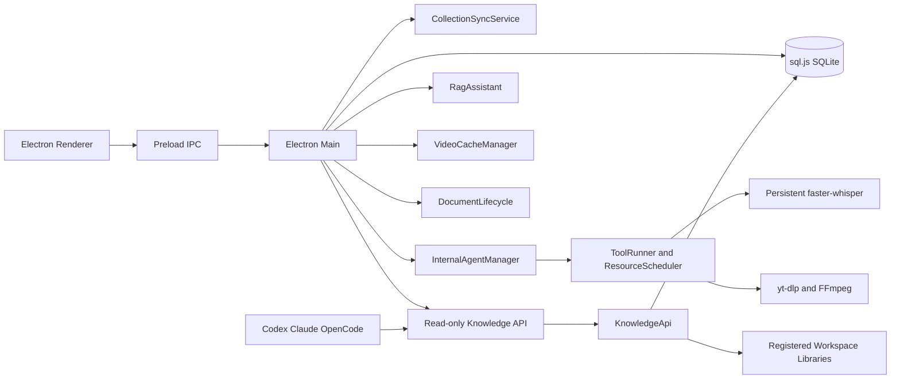

# 星藏家 Design

Version: `0.10.0`

## 1. Product Goal

星藏家 converts Bilibili favorites and application-managed cached videos into durable Markdown knowledge. The product is a desktop workbench, not a landing page: account login, synchronization, task controls, AI execution, media tools, documents, RAG, video playback, export, settings, and status inspection all live in one application.

The system optimizes for:

- long-running local ownership of personal knowledge;
- repeatable video-to-Markdown processing;
- safe multi-Agent concurrency inside the application;
- recoverable collection synchronization and task interruption;
- exact Markdown and image access for local RAG clients;
- project-local dependencies and portable distribution.

## 2. Core Boundaries

1. The desktop application is the only writer of SQLite, task state, Workspace indexes, artifacts, cookies, tool runs, and internal Worker records.
2. Video-summary execution is application-internal. External Agents cannot register video Workers, claim tasks, execute media tools, heartbeat, submit, or abort.
3. The public local HTTP API is read-only knowledge access across all completed Markdown documents.
4. Task Overview switches affect internal Agent claim eligibility. A disabled unfinished task is skipped; an already completed document remains readable.
5. Each internal queue Agent binds its own collection. No global active external collection exists.
6. Single-video mode keeps one canonical output per internal collection/BV pair.
7. Only deletion of a completed task that still belongs to an active Bilibili favorite restores that task to pending.

## 3. Architecture



Important modules:

- `src/main.js`: Electron lifecycle, secure IPC, login session, Renderer snapshots.
- `src/core/store.js`: sql.js persistence and typed record helpers.
- `src/core/collection-sync-service.js`: transactional favorite reconciliation.
- `src/core/internal-agent-manager.js`: internal queue and single-video orchestration.
- `src/core/tool-runner.js`: media tools, resource pools, leases, ASR services.
- `src/core/hardware-capabilities.js`: local ASR environment evaluation.
- `src/core/document-lifecycle.js`: managed deletion and restoration policy.
- `src/core/api-server.js`: minimal read-only local HTTP server.
- `src/core/knowledge-api.js`: knowledge catalog, exact content, search, assets.
- `src/core/rag-assistant.js`: in-app RAG sessions, tools, sandbox, compression.
- `src/core/video-cache-manager.js`: managed download queue and video library.

## 4. Persistence

The database is `workspace/orchestrator.sqlite`. sql.js exports atomically through a temporary file, fsync, backup, and recovery path. Transaction save failure restores the pre-transaction database.

Main record scopes include:

- users, collections, tasks, removedFavoriteTasks, unavailableTasks;
- workers, internalAgentSessions, taskEvents, toolRuns;
- videoCacheCollections, videoCache, videoCacheJobs;
- ragProviders, ragModels, ragSessions, ragMessages;
- workspaces, settings, activities;
- collectionSyncTransactions and submission finalization journals.

Legacy fields such as historical external activation or single-video revision markers may remain in existing databases but have no active product behavior. New code does not create external activation state or multiple single-video revisions.

## 5. Workspace Libraries

At least one Workspace is always registered and one is default. New artifacts use the default library.

```text
<workspace>/
  orchestrator.sqlite
  <user>/
    cookies/
    <collection storageName>/
      <video metadata name>/
        summary.md
        info.json
        cover.*
        frames/
        subtitles/
        asr/
        comments/
        tool-runs/
```

Collection display names may change, so path identity uses collection ID plus a persistent `storageName`. The knowledge API accepts artifacts only inside a registered Workspace real path and rejects traversal and symlink escape.

## 6. Bilibili Login

The Bilibili WebView uses `persist:bili-orchestrator`, Electron sandboxing, no Node bridge, official-domain navigation only, denied popups, and persistent login state. Successful login automatically synchronizes user ID, name, avatar, cookies, and favorite folders.

Saved account passwords require Electron `safeStorage`. Netscape cookie files remain plaintext because yt-dlp requires them and are stored under the user Workspace hierarchy with export time metadata.

## 7. Collection Sync

Synchronization is a desktop-owned maintenance transaction:

1. Resolve the immutable Bilibili collection ID and current local snapshot.
2. Persist a `collectionSyncTransactions` recovery record.
3. Mark the collection `syncing` and `syncReady=false`.
4. Stop every internal queue Agent bound to the collection.
5. Abort current attempts, cancel tools, remove attempt files, and invalidate work IDs.
6. Fetch every remote page before changing inventory and retain reported count, visible count, and visibility gap.
7. Reconcile additions, completed archives, explicit unavailable tombstones, rename state, and counts in one SQLite transaction. Missing-item removal is allowed only for a zero-gap snapshot.
8. Remove the recovery record only after commit.
9. On interruption or startup recovery, restore the previous snapshot and log the rollback.

Reconciliation policy:

- new remote item -> create pending task;
- removed unfinished item -> remove task;
- removed completed item -> keep document and mark `favoriteState=removed`;
- renamed folder -> update display/source name, retain storage identity;
- deleted remote folder -> retain completed documents, mark collection deleted, remove unfinished work, block restart;
- unavailable-video tombstone -> never recreate during later sync.
- reported count exceeds visible pagination -> merge visible additions/updates, preserve every absent local task and artifact as unresolved, expose `remoteReportedCount`, `remoteVisibleCount`, `visibilityGap`, and `preservedUnresolved`;
- a later zero-gap snapshot -> resume ordinary missing-item removal/archive reconciliation.

## 8. Internal Task Lifecycle

Queue workflow states include idle, running, draining, stopping, paused, completed, model-unavailable, unavailable, and error reporting phases.

Task claim requirements:

- selected collection exists and is dispatchable;
- Bilibili collection is sync-ready and not deleted;
- task belongs to the session collection;
- task is enabled;
- task is pending, failed, or an unowned rejected record;
- task is not excluded by the current loop.

Every claim creates a new random `workId`, work directory, claim timestamp, and 15-minute lease. The persistent Worker ID belongs to the Agent session and is reused across videos; model messages are not.

All interruption paths converge on `abortTaskAttempt`:

- cancel queued/running tools;
- stop provider generation;
- remove attempt files or preserve registered cache sources;
- clear work ID, claim, lease, output and error fields;
- return eligible ordinary tasks to pending;
- pause the internal Worker when required.

Confirmed deleted/down/unavailable video errors use `removeUnavailableTask`, not ordinary rollback. Classification requires explicit Bilibili terminal codes (`-404`, `62002`, `62004`, `62012`) or unambiguous video removal wording. Generic file-not-found, media, ASR, network, and Markdown validation errors never create unavailable tombstones. Startup recovery restores legacy validation-error tombstones to pending work.

## 9. Single-Video Lifecycle

Single-video mode creates a normal internal task with `singleTask=true`, but duplicate handling is collection/BV scoped:

- active duplicate -> return existing session;
- completed duplicate without decision -> require explicit user decision;
- abandon -> no state change;
- overwrite -> clean the old artifact, reuse one task identity, reset output state, and process from the beginning;
- failed/pending/missing artifact -> clean and reuse from the beginning;
- no duplicate -> create a fresh task.

There is no accepted revision history. `revision` remains `1` only for compatibility with old records. Overwrite cannot leave sibling single tasks for the same collection/BV.

Deleting a completed single-video document removes all same-BV single-task siblings, linked single sessions, generated files, and task/video records. A later identical BV creates a fresh task and does not show the duplicate modal.

## 10. Document Lifecycle

`deleteCompletedDocument` owns document deletion:

| Source state | Result after deletion |
| --- | --- |
| Active Bilibili favorite | Remove generated artifacts and restore same task to pending |
| Removed Bilibili favorite | Remove artifacts and task; write removed-favorite history |
| Deleted Bilibili collection | Remove artifacts and task; do not restore |
| Single-video internal task | Remove artifact, task, linked session |
| Other local/internal task | Remove artifact and task |
| Cache-backed source | Preserve registered video, cover and cache metadata |

Restoration always uses immutable `collectionId`; collection rename cannot redirect a task.

## 11. Read-Only Knowledge API

The server binds only to `127.0.0.1`. Protocol `3.0` exposes:

```text
GET /api/manifest
GET /api/health
GET /api/knowledge/catalog
GET /api/knowledge/documents
GET /api/knowledge/documents/<documentId>
GET /api/knowledge/documents/<documentId>/content
GET /api/knowledge/documents/<documentId>/assets
GET /api/knowledge/documents/<documentId>/assets/<assetId>
GET /api/knowledge/search
```

Directory filters include user, collection, BV, title, owner, tag, publish date, favorite date, and sort order. Responses expose semantic metadata but no local paths, cookies, keys, work IDs, or mutable task internals.

Content reads are exact UTF-8 Markdown, paged by 1-based lines with a maximum page size and SHA-256. Search scans at most 128 MiB per request and reports partial results. A snippet is never presented as full source.

Assets are document-scoped raster images. The server validates artifact root, regular file, real path, size, raster signature and opaque asset ID; supported formats are PNG, JPEG, GIF, WebP and AVIF. ETag supports repeat reads.

Old external video workflow prefixes return HTTP `410` with `EXTERNAL_VIDEO_WORKFLOW_DISABLED`. Non-GET knowledge requests return `405`.

The API rejects unrelated browser Origin values and omits wildcard CORS. It does not authenticate other local processes and must not be exposed to a LAN or public network.

## 12. Tool and ASR Scheduling

Internal tools are registered in SQLite but invoked only through `ToolRunner`. Pools:

- API: Bilibili metadata/subtitles/comments with start-rate limiting;
- media: yt-dlp, FFmpeg, audio extraction and keyframes;
- disk: cleanup;
- ASR: one CUDA lane and optional CPU lane.

GPU ASR is a persistent faster-whisper service. CPU ASR is disabled by default and starts only after the user enables it.

Hardware detection combines:

- project-local Python and faster-whisper health process;
- selected `small` or `medium` model files;
- CTranslate2 version and CUDA device count;
- `nvidia-smi` adapter name, total/free/used memory;
- Windows x64 CPU runtime support, system memory, CPU thread count.

Recommended thresholds:

| Model | GPU total | CPU system memory |
| --- | ---: | ---: |
| small | 2048 MiB | 6144 MiB |
| medium | 4096 MiB | 8192 MiB |

Unsupported GPU lanes are disabled. Unsupported CPU environments disable the CPU toggle and block workflow startup when no valid ASR path exists.

Every video passes through the ASR precondition and language-detection workflow. Sources with audio produce sentence-level SRT, readable timeline text, structured segments, language/probability, coverage and silence diagnostics. A video-only source produces a successful empty diagnostic with `noAudioStream=true`; the Agent continues with station subtitles and keyframes instead of retrying an impossible extraction.

Keyframe extraction writes FFmpeg MJPEG output through an image pipe and then persists validated numbered JPEG files. It never exposes the artifact directory to FFmpeg's image-sequence pattern parser, so percent signs or other title metadata in Bilibili, cached-video, and single-video paths cannot corrupt `frame-001.jpg` naming. Material discovery accepts only concrete numbered frame files and ignores legacy pattern placeholders.

## 13. Markdown Validation

Accepted output requires:

- Markdown and `info.json` under the assigned artifact directory;
- opening order Summary, Mind Map, Contents;
- Mermaid fenced mind map;
- substantive body and timeline links;
- subtitle comparison and ASR evidence;
- keyframe references that resolve to validated local images;
- comments section and processing record;
- temporary media cleanup unless cache preservation is explicit.

Before validation, deterministic normalization repairs frame filename placeholders against the real extracted frame inventory, rejects literal FFmpeg pattern files, canonicalizes decorated/numbered headings, and orders Summary, Mind Map, and Contents. A remaining validation failure returns the task to pending and cannot be reclassified as a missing video.

Finalization applies metadata naming with Windows path budgeting, move retries, copy fallback, and a recoverable journal.

## 14. Context Management

Queue Agents create a clean model request for every video. At 82% estimated context usage, or after a provider context-limit response, the same provider/model runs independent semantic map/reduce requests over every source chunk. The resulting evidence pack preserves timeline, facts, steps, parameters, code, constraints, conflicts and uncertainty. It does not alter Worker ID or work ID.

RAG sessions retain conversation history. At 75% of the model window or a lower reserve-safe input boundary, automatic compression summarizes eligible history while preserving the current user turn and avoiding duplicate resend of already summarized messages. Manual compression remains available.

## 15. RAG Assistant

RAG sessions share provider/model configuration with video Agents but have separate conversation state, sandbox, permissions and usage counters. Knowledge tools provide catalog search, exact Markdown, metadata dates and images. Restricted mode requires approval for shell commands, sandbox-external paths, default-browser opening and private-network browsing.

The UI displays only reasoning text returned by the provider. Unsupported vision, tools, reasoning, image output, compression or subagent capabilities degrade honestly.

## 16. UI Design

The application uses a custom frameless title bar, seven themes, a compact left sidebar and non-default form controls. Settings navigation has three levels:

```text
设置
  应用设置
  状态查询
    Agent 工作列表
    Agent 工具模块
    Agent 工具状态
```

Favorite Sync keeps the last successful reported, visible, visibility-gap, unavailable, and valid-task counts under the progress bar. Task Overview has no external activation button. Its collection selector defines the inventory currently inspected, and row switches affect internal workflow claims. Mutually exclusive status segments show and filter all, pending, claimed, done, failed/rejected, and disabled tasks; text/date/duration filters compose with the selected status.

Startup is an independently scrollable page. It includes a five-step first-run journey whose buttons navigate in order to model configuration, Bilibili login, favorite synchronization, task inspection and internal Agent workflow creation. The collapsed external knowledge API prompt documents health/manifest discovery, URL-encoded filters, supported sort forms, 1-1000-line exact Markdown pages, validated image reads, source citation and bounded error recovery. Agent Tool Status includes the read-only protocol reference. Resource Scheduling displays ASR hardware compatibility and disables unsupported controls.

## 17. Startup and Dependencies

The main window appears before heavy initialization. Bootstrap progress covers database, dependencies, models, resource pools, ASR health, knowledge API and login synchronization. Tool probes run during startup and report online/degraded/offline state. Startup uses content-height rows and its own vertical scroll container so onboarding, health, prompt and the bounded 500-event log remain reachable at the default and reduced window sizes.

Project-local runtime and models may be installed from GitHub Release assets. Installation uses staging, backup, SHA-256 verification, a transaction journal and startup rollback. Archives may write only below `runtime/`.

## 18. Security and Reliability

- Electron main and WebView run with sandbox boundaries and strict navigation policies.
- Credentials require safeStorage; cookies remain local plaintext only where tools require it.
- Provider Base URLs, headers, private networks and hidden browsing are validated.
- Markdown raw HTML is disabled; images are constrained by source, size and signature.
- Filesystem deletion and API reading resolve real paths under registered roots.
- Application shutdown and restart recovery abort active video attempts rather than resuming partial state.
- SQLite and dependency installation use recoverable writes.

## 19. Verification

`npm run verify:release` checks package/lock versions, machine-specific paths, JavaScript/Python syntax, all integration tests, both ASR models and npm audit.

Protocol and lifecycle gates include:

- `scripts/knowledge-api-test.js`;
- `scripts/hardware-capabilities-test.js`;
- `scripts/internal-agent-test.js`;
- `scripts/document-lifecycle-test.js`;
- `scripts/collection-sync-test.js`;
- `scripts/security-test.js`;
- `scripts/smoke-test.js`.
