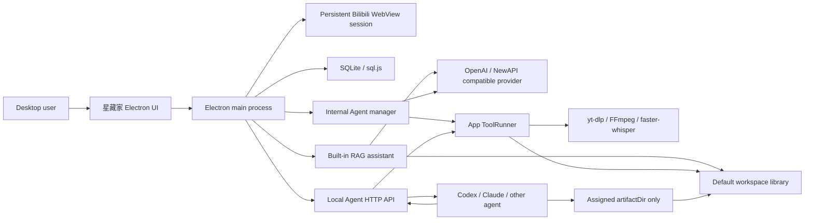

# 星藏家 Design

## 1. Product Goal

星藏家 is a local Electron desktop workbench for turning Bilibili favorite-folder videos into structured Markdown through external or application-managed agents.

The desktop app owns orchestration, persistence, credentials, task leasing, tool execution, validation, and artifact inventory. Codex, Claude Code, and other agents use the local HTTP API to claim one task at a time, ask the app to execute media tools, and submit their final work.

The same pipeline has two workers: external agents use the local HTTP API, while internal agents use a main-process manager and user-configured compatible models. Both paths share Worker identity, leases, ToolRunner resources, validation, cleanup, final naming, analytics, and Workspace archives. Separately, the built-in RAG assistant analyzes Markdown that has already passed submission validation.

## 2. Core Boundaries

- The app is the source of truth for users, collections, tasks, leases, tools, runs, submissions, workspaces, and analytics.
- Agents do not edit SQLite, app indexes, collection exports, or workspace configuration.
- Agents only write task artifacts inside the `artifactDir` returned by the claim API.
- Agents never launch project media scripts directly. They call the tool-run API and the app launches the process.
- Disabled tasks are excluded from claims and cannot start new tool runs.
- The desktop Task Overview page owns the active collection target for external HTTP API agents. Internal Agent sessions use the collection selected when each session is created and are independent of this external target.
- Confirmed deleted, removed, or unavailable videos are terminal: the app removes them from task/video inventory, records an `unavailableTasks` tombstone, and collection sync must not recreate them.
- A task lease lasts 15 minutes and can be extended with heartbeat calls.
- Submission paths and Markdown structure are validated before a task becomes complete.
- Accepted documents begin with `小结 -> 思维导图 -> 目录`; the mind map is a valid Mermaid fenced block.

## 3. Architecture



Runtime modules:

- `src/main.js`: window, IPC, startup, encrypted credentials, workspace configuration.
- `src/core/store.js`: SQLite-backed records and migrations.
- `src/core/api-server.js`: Agent-only HTTP API and task lifecycle.
- `src/core/collection-sync-service.js`: desktop-owned Bilibili collection synchronization and indexing.
- `src/core/collection-state.js`: shared remote-folder, favorite-membership, immutable-storage, and dispatch-readiness rules.
- `src/core/submission-artifacts.js`: shared final naming, relocation, and cached-video record updates.
- `src/core/unavailable-task.js`: terminal unavailable-video removal, attempt cleanup, tombstones, and sync suppression.
- `src/core/network-policy.js`: Bilibili URL, local API origin, and private-network policies.
- `src/core/desktop-security.js`: main-window and Bilibili WebView navigation hardening.
- `src/core/atomic-file.js`: recoverable whole-file SQLite persistence.
- `src/core/tool-runner.js`: controlled child processes, timeouts, logs, cancellation.
- `src/core/analytics.js`: collection, agent, and tool usage statistics.
- `src/core/workspace.js`: path safety and workspace layout.
- `src/core/bili.js`: Bilibili session APIs and cookie export.
- `src/core/rag-assistant.js`: compatible providers, RAG sessions, retrieval, streaming, model tools, approvals, and usage accounting.
- `src/core/internal-agent-manager.js`: persistent internal Worker sessions, per-task model-context budgeting, collection queues, single-task mode, streaming generation, validation, cleanup, and canonical Workspace output.
- `src/core/dependency-manager.js`: project-relative dependency probes, GitHub Release resolution, queued download, SHA-256 verification, safe extraction, and install progress.
- `src/renderer/*`: frameless desktop UI.

## 4. Persistence

The project uses `sql.js` and writes the database to:

```text
workspace/orchestrator.sqlite
```

The generic `kv` table currently stores these scopes:

- `users`
- `collections`
- `videos`
- `tasks`
- `unavailableTasks`
- `taskEvents`
- `submissions`
- `tools`
- `toolRuns`
- `workers`
- `activities`
- `workspaces`
- `settings` (including the active collection target)
- `credentials`
- `ragProviders`
- `ragSessions`
- `ragMessages`
- `ragAttachments`
- `ragModelUsage`

Task records are migrated on startup so legacy tasks default to `enabled: true`.

Passwords are encrypted with Electron `safeStorage` where available. The renderer only receives a decrypted password when a saved account is explicitly selected for login.

## 5. Workspace Libraries

The app can register multiple workspace roots. Exactly one must be the default workspace. New claims always use the current default; changing the default does not move or delete existing artifacts.

The built-in default is the project-local directory:

```text
<project>/workspace
```

Agent artifacts use this layout:

```text
<workspace-root>/
  <Bilibili username>/
    <favorite-folder name>/
      [BV-...][title-...][UP-...][published-...][favorited-...][collection-...][tags-...]/
        [BV-...][title-...][UP-...][published-...][favorited-...][collection-...][tags-...].md
        info.json
        frames/
        asr/
        comments/
        tool-runs/
```

Directory and Markdown basenames use one app-owned metadata policy. BV id, title, owner, publish date, favorite-added date, source collection, and tags are enabled by default and independently persisted in SQLite. Publish and favorite dates use visibly distinct labels. Fast collection sync does not fetch per-video tags; submission reads the validated `info.json`, normalizes tags, and then atomically renames the accepted artifact directory and Markdown. Existing accepted artifacts are not silently migrated when settings change. Numeric suffixes resolve collisions.

App-owned collection exports are kept under:

```text
<workspace-root>/.star-note/exports/<username>/<favorite-folder>/
```

Bilibili cookie exports remain app-managed under the project system workspace:

```text
workspace/users/<username>/cookies/
```

Removing a workspace from Settings only removes its registry record. It never deletes files from disk.

## 6. Bilibili Login

- Web content uses the persistent Electron partition `persist:bili-orchestrator`.
- Closing and reopening the app preserves the Bilibili site session.
- Opening the login page does not restart login when the persisted session is already valid.
- Selecting another saved credential is the explicit account-switch operation.
- Account switching clears Bilibili-domain cookies and site storage before attempting the new login.
- One-click login stays disabled until the real Bilibili password form is available.
- SMS verification is detected inside the WebView and bridged to controls outside the WebView.
- Successful login detection automatically refreshes username, avatar, cookies, and favorite folders.
- Manual login detection remains available as a fallback.

The top-right profile popover is disabled while logged out. After login it lists all favorite folders with video counts and latest favorite-addition dates. It has a hover bridge and delayed close so the list can be entered and clicked reliably. Clicking a synced folder opens its task inventory.

## 7. Collection Sync

Collection sync:

1. Resolves the current Bilibili account and stable favorite-folder id. Display names are mutable; `storageName`, `mediaId`, and existing artifact roots are not changed by a remote rename.
2. Persists a `collectionSyncTransactions` recovery record, marks the collection `syncing`, blocks external claims, immediately stops every internal queue Agent bound to that collection, aborts all current internal/external attempts, cleans attempt files, and invalidates their `workId` values.
3. Reads every page of the remote video list before changing inventory. Partial pagination, HTTP errors, cancellation, process exit, and crash restore the previous complete collection snapshot and emit only a persisted rollback log entry.
4. Applies the complete remote/local diff in one SQLite transaction. New videos become `pending`; current videos refresh metadata without resetting accepted artifacts; unavailable-video tombstones remain suppressed.
5. A missing unfinished favorite task is removed from dispatch inventory and recorded in `removedFavoriteTasks`, so stale external requests receive `REMOVED_FROM_FAVORITES`. A missing `done` task keeps its artifact and `outputMarkdown`, becomes disabled/archived, and gains the `（已移出收藏夹）` display suffix.
6. Folder discovery is authoritative for known Bilibili `mediaId` values. A missing remote folder gains `（已在B站删除的收藏夹）`, keeps only completed local artifacts, permanently blocks dispatch, and marks bound internal sessions collection-unavailable. A reappearing or renamed folder requires a successful full sync before restart.
7. Successful sync leaves internal sessions stopped for explicit user restart and leaves external dispatch paused until the user reactivates that collection in Task Overview. It then writes a compact app-owned synchronization snapshot and one persisted completion activity.

Task metadata includes BV id, title, UP owner, duration, cover, URL, favorite time, publish time, and collection ownership.

RAG search, document listing, exact Markdown reads, and knowledge-image inspection expose favorite membership separately from the historical favorite-added date. Archived accepted documents remain usable in Document Library, Export, and RAG, while the model is told whether the item was removed or its source Bilibili folder was deleted.

The Collections page shows loaded/total counts and a determinate progress bar. Progress events are not written to the activity table, which avoids hundreds of low-value log records during large-folder synchronization.

After a persisted or new login succeeds, the automatic folder discovery result is also written into the Collections page selector. Manual discovery remains available. The sync action stays disabled until that selector contains a real folder. Clicking a folder in the top-right profile popover opens the Collections page and selects the same folder instead of navigating to task inventory.

## 8. Task Lifecycle

Statuses:

```text
pending -> claimed -> done
                   -> rejected -> claimed
                   -> failed   -> claimed
claimed -> pending (lease expiry)
```

The independent `enabled` flag controls dispatch:

- `enabled: true`: eligible for claims when status permits.
- `enabled: false`: visible in inventory, but never returned by claim and unable to launch tools.

Inventory controls support:

- exported-user switching;
- exported-collection switching;
- explicit activation of the collection that agents are allowed to work on;
- BV id, UP owner, and title search;
- favorite-date start/end filters;
- newest-first and oldest-first sorting;
- dual-handle duration filtering;
- selecting all visible tasks;
- inverting visible selection;
- batch enabling and disabling;
- per-task enable toggles.

Claim order is newest favorite-addition time first.

## 9. Agent API

Default base URL:

```text
http://127.0.0.1:17391
```

Endpoints:

```http
GET  /api
GET  /api/manifest?workerId=<workerId>
GET  /api/health
GET  /api/tool-health
POST /api/workers/register
GET  /api/workers
GET  /api/workers/:workerId
GET  /api/collections
GET  /api/active-collection
GET  /api/tasks?collectionId=<id>
POST /api/tasks/claim
GET  /api/tasks/:id
POST /api/tasks/:id/heartbeat
POST /api/tasks/:id/submit
POST /api/tasks/:id/abort
POST /api/tasks/:id/fail
GET  /api/tools
POST /api/tasks/:taskId/tools/:toolId/run
GET  /api/tool-runs
GET  /api/tool-runs/:runId?log=1
POST /api/tool-runs/:runId/cancel
GET  /api/stats?collectionId=<id>
GET  /api/workspaces
GET  /api/templates/video-summary
```

`GET /api` and `GET /api/manifest` are the discovery entry points. They return protocol version, current desktop-selected collection, every Agent-facing endpoint with method/parameters, enabled tool contracts, the template URL, and the standard pause message.

The API accepts origin-less local process requests and same-origin requests only. Browser pages from unrelated origins receive HTTP `403`; wildcard CORS is not enabled. JSON request bodies are capped at 1 MiB and all asynchronous handlers terminate through one response/error boundary. Collection synchronization, task inventory switches, and tool enable state are desktop IPC responsibilities and are intentionally absent from the public Agent API.

Every fresh Agent session first registers its actual caller tool and model:

```json
{
  "tool": "codex",
  "model": "gpt-5",
  "sessionLabel": "optional human note"
}
```

`POST /api/workers/register` creates and returns an app-owned identity such as `worker-...`. A Worker can claim multiple tasks over its session lifetime. Every successful claim also creates a one-time `workId` such as `work-...`; heartbeat, tool-run/cancellation, submission, and abort bodies require both IDs. Agents must never invent a `workId`.

A long-running Worker keeps its `workerId` while processing task after task, but `workId` is never a session identifier: claim N and claim N+1 always receive different values, including when both claims happen to target the same video after a rollback.

The user first selects and activates a collection in the desktop task page. `GET /api/active-collection` exposes that target. The claim endpoint always uses it; an agent request cannot override the active target with a different collection id or name.

Recommended claim body:

```json
{
  "workerId": "worker-..."
}
```

The claim response includes Worker identity, one-time Work identity, user, collection, video, lease, cookie, workspace, assigned artifact path, document requirements, API-manifest URL, Markdown-template URL, and every enabled app tool.

`POST /api/tasks/:id/abort` is the canonical interruption path. It requires the current `workerId`, `workId`, and an actionable `reason`; it cancels queued/running app tools, removes attempt files, invalidates `workId`, clears claim/completion/output fields, records an `attempt-aborted` event, and returns the task to `pending`. `/fail` is retained only as a compatibility alias with identical rollback behavior. The operation is idempotent so simultaneous stop signals from the tool layer and Agent manager cannot duplicate destructive work.

Confirmed video deletion/removal is a separate terminal transition. Strong Bilibili/yt-dlp signatures produce `BILIBILI_VIDEO_UNAVAILABLE`; `unavailable-task.js` cancels other active runs, cleans attempt files, removes `tasks` and `videos` records, records a `video-unavailable` event and `unavailableTasks` tombstone, and updates collection inventory. Collection synchronization checks that tombstone before persistence, so a later full sync cannot revive the task. Internal Agents count this outcome as skipped and continue; external callers receive HTTP `410`/terminal guidance. A startup migration performs the same transition for older pending entries already titled `已失效视频` and reclassifies matching historical failures as skipped.

An old caller cannot resume through a stable video `taskId`: every task-changing endpoint validates the current `workId`. Missing work IDs return `WORK_ID_REQUIRED`; invalidated, expired, completed, or superseded IDs return HTTP `409`, `WORK_ATTEMPT_ENDED`, and a `claim-new-task` directive with `keepWorkerId: true`. Tool-run polling also exposes the ended-attempt directive. Reclaiming the same video creates a different `workId`.

Normal artifacts are removed as a whole. A cache-collection task preserves only its registered merged video, local cover, `info.json`, and `cache-record.json`; generated audio, ASR, subtitles, frames, comments, drafts, manifests, and tool logs are removed. Application shutdown, crash recovery on the next launch, lease expiry without an active tool, internal Agent stop, login-required restart, and fatal infrastructure errors all use the same service. No interrupted summary tool run is resumed after restart.

Worker allocation state is controlled only by the desktop UI. Pausing a Worker stops future claims and returns HTTP `423`, `WORKER_PAUSED`, and `来自用户的信息，你需要暂停工作`. It does not invalidate an already claimed task, so the Worker may heartbeat or submit that task. Reactivation resumes future allocation. The public Agent API exposes Worker status but cannot pause or reactivate a Worker.

## 10. Tool Modules

Default modules:

- `video-info`
- `material-bundle`
- `merged-video`
- `asr`
- `bili-subtitles`
- `comments-top3`
- `clean-cache`

Tool execution rules:

- The API checks task and tool enable state.
- The app validates `artifactDir` against the task's allowed root.
- ToolRunner first persists every request as `queued`; the HTTP API returns `202` before execution begins.
- ToolRunner spawns a hidden child process without shell string composition.
- Each run has a SQLite record and a log under `artifactDir/tool-runs/`.
- Runs expose stage, resource pool/lane, queue position/length, wait reason, estimated wait, timeout, cancellation, and activity events.
- Queued and stale running records are reconstructed from SQLite after an application restart.
- A queued or running tool run protects its parent task lease from automatic reclamation.
- Temporary downloaded video/audio is removed by `clean-cache` after final artifacts are ready.

Resource pools:

- `api`: two lanes with an 850ms minimum start interval for Bilibili API rate shaping.
- `media`: two lanes shared by yt-dlp, merge, audio extraction, and frame processing.
- `disk`: two lanes for cleanup and other bounded disk work.
- `asr`: one persistent CUDA lane and one optional persistent CPU lane.

Scheduling is fair across Worker IDs: after a lane completes, the scheduler prefers a queued request from a different Worker before another request from the last Worker. Every lane remains single-consumer; concurrency comes from explicit lanes rather than multiple calls entering one process.

At every application startup, the main process launches `node tools/video-tool.js health <action>` for every registered tool. A tool is online only when the script returns the expected `pong` payload and all required local commands are resolvable. A responsive module with missing dependencies is marked degraded; missing scripts, invalid responses, and timeouts are marked offline. The latest results are exposed through `GET /api/tool-health` and the Startup page.

FFmpeg and yt-dlp are project-local dependencies and are resolved before PATH. faster-whisper is deployed under `runtime/faster-whisper` on a project-local CPython 3.12 runtime. Multilingual `medium` is the default balanced model and `small` is the lower-latency/lower-memory alternative under `runtime/models`; the signed project-local Microsoft Visual C++ runtime and CUDA 12 cuBLAS/cuDNN DLL directories are registered before CTranslate2 loads. Settings may switch models only while the ASR pool is idle. The application disables ASR lanes, stops both persistent services, changes the model, and safely reloads enabled services before accepting new work. `FASTER_WHISPER_BIN` remains an optional explicit override.

`tools/faster-whisper-cli.py` remains the setup, health, and standalone diagnostic contract. `tools/faster-whisper-service.py` is the production NDJSON service contract: it loads one model, accepts sequential transcription requests, and writes SRT, plain text, and structured JSON. `src/core/asr-service.js` owns its lifetime and applies an exponential restart backoff after unexpected native exits so multiple queued jobs cannot create a process-spawn storm.

The GPU service starts the real project CPython process directly, avoiding the Windows venv launcher between Electron and the long-lived NDJSON pipes, and uses CUDA `float16`. Canonical PCM audio is physically divided into temporary 10-second WAV files so every decoding unit is bounded; chunk files are deleted immediately and progress events are persisted on the tool run. Before dispatch, `nvidia-smi` must report at least 1024MiB free after model load; otherwise the request remains queued with `GPU_CAPACITY_WAIT`. The CPU `int8` service is disabled by default, does not load at startup, and can only be enabled from desktop Settings.

`material-bundle` is a staged plan rather than one monolithic process: Bilibili metadata, per-part station subtitles, and comments use the API pool; download/frame/audio preparation uses the media pool; transcription uses the persistent ASR pool. Direct `asr` similarly prepares `audio/audio.wav` in the media pool before entering the ASR pool. `scripts/setup-faster-whisper.ps1` reproduces both ASR models and the complete runtime through `npm run setup:asr`.

Resource gates classify recoverable waits separately from terminal infrastructure faults. Capacity waits remain queued. After three consecutive ASR process startup crashes, the gate rejects affected queued jobs with `ASR_INFRASTRUCTURE_FAILURE`, structured likely causes, and no further automatic task claims. ToolRunner pauses the Worker and returns the claimed task to pending. An internal Agent changes to `blocked` and writes a user-visible diagnostic report into its output stream; an external Worker receives a `stop-and-report` directive and the same reason on its next claim request.

Every summary task must run ASR even when a Bilibili subtitle exists. Station subtitles are validated against each part's duration and minimum timeline coverage before they are declared usable; rejected resources remain as diagnostic JSON with a machine-readable reason. The agent compares usable transcripts and may use selected frames with multimodal reasoning when the better transcript is unclear. Comment analysis uses at most the top three hot comments.

The reference document contract is stored at `templates/video-summary-template.md` and returned by `GET /api/templates/video-summary`. It includes front matter, a conclusion-first summary, an immediately following Mermaid mind map, linked contents, timestamp links, selected frames, subtitle comparison, top-three comment analysis, and processing provenance.

Mermaid 11 is bundled under project-local `node_modules` and loaded by the Electron renderer without a CDN. Preview converts `language-mermaid` blocks to SVG with `securityLevel: strict`. A rendering failure stays local and displays the source plus an actionable error. For legacy accepted documents, preview promotes an existing mind-map section ahead of the table of contents without rewriting the source file.

## 11. Submission Validation

Submission checks:

- `artifactDir` is inside the task's allowed collection root.
- Markdown and metadata files exist inside the artifact directory.
- Required sections exist: summary, contents, mind map, subtitle comparison, comment analysis, and processing log.
- Opening section order is `小结 -> 思维导图 -> 目录`, and the mind-map section contains a Mermaid fenced block.
- Referenced local images exist and remain inside the artifact directory.
- A rejected submission records validation errors and can be corrected and resubmitted.

## 12. Analytics

Collection analytics show enabled, processing, failed/rejected, disabled, completed, and progress counts.

All performance records are separated by app-generated Worker ID. Tool/model/session labels are descriptive dimensions and never merge two Worker sessions.

Per-Worker metrics:

- claimed task count;
- completed task count;
- failed/rejected count;
- success rate;
- weighted processing ratio;
- active tasks and lease expiry;
- tool calls, tool success rate, and average tool duration.

Weighted processing ratio is defined as:

```text
total processing seconds / total video seconds
```

Lower values mean faster processing after normalizing for video duration.

Tool analytics show:

- call count;
- active runs;
- success and failure count;
- success rate;
- average duration;
- unique caller count;
- calls per Worker, including caller tool and model.

The task-page performance popover always opens, including before the first claim. Its empty dashboard explains which independent Worker charts will appear. The Work Agent page is the full management view: it lists each Worker session, current tasks, independent performance charts, caller metadata, last activity, and pause/reactivate controls.

## 13. UI Design

Brand: `星藏家`.

The app uses a minimal flat mobile-style icon: a white rounded-square tile containing a star over three layered collection bookmarks. The reproducible source is `scripts/generate-icon.py`, which writes `assets/star-note.png` and `assets/star-note.ico` without remote assets or font dependencies.

Window behavior:

- frameless custom title bar;
- default size `1350 x 836`;
- startup always restores and centers the default size instead of preserving a previous resize or maximized state;
- minimum size `980 x 680`;
- narrow collapsible left navigation with standalone Startup, four expandable page groups, and fixed bottom utilities;
- content grids consume the width released by a collapsed sidebar instead of only translating left;
- no page-level scrolling at the default size;
- internal scrolling for task, tool, run, log, and workspace inventories;
- themed thin scrollbars, custom selects, checkboxes, ranges, and focus states;
- animated bottom-right operation notifications;
- seven persisted themes.
- each theme has its own startup loader colors; theme changes use a point-origin radial View Transition that fades into the destination palette.
- restrained navigation type scale and weight with fixed icon/text columns; Claude Code keeps its dedicated font family.

Pages:

- Startup: themed backend progress, per-tool interface health, global totals, a collapsed “External Agent application integration video-summary prompt”, and up to the newest 500 processing activities.
- Bilibili login: persistent WebView, encrypted account vault, one-click login, SMS bridge.
- Collections: folder discovery and full collection sync.
- Task Overview: explicit external-Agent video-summary range activation, a compact progress band, primary search, collapsible advanced filters, batch state, and agent performance.
- Work Preparation group: Bilibili Login, Collection Sync, and Task Overview.
- AI group: RAG Knowledge Assistant, Agent Video Summary Workflow, Single Video Summary, and shared AI Model Configuration. Single Video Summary also has a standalone root navigation shortcut immediately below Startup.
- Status Query group: Agent Work List, Agent Tool Modules, and Agent Tool Status. Agent Tool Status combines run inventory, tool-call analytics, and API reference in one page.
- Document Browse group: Markdown library and Export.
- Agent Video Summary Workflow: concurrent persistent sessions, each bound to an app-owned Worker ID, provider/model, collection, per-task progress stream, collection-wide progress, token usage, and pause/stop controls. Session rows are ordered by immutable creation time, newest first, and expose a right-click delete action for inactive workflows.
- Live Agent rendering patches progress, stream text, reasoning, logs, and list summaries in place. Full structural rendering occurs only when action availability/session structure changes, so pointer events and independent scroll containers survive frequent model/tool deltas. Stop actions are deduplicated client-side and complete an idempotent backend rollback immediately.
- Single Video Summary: direct BV/URL input, adjustable material requirements, internal collection creation, live generation, canonical `内置用户/<内置收藏夹>` output, and buttons for opening the collection or completed artifact directory.
- AI Model Configuration: the shared multi-provider/multi-model source for RAG, collection Agents, and single-task Agents. Sessions whose provider or enabled model is removed are marked unavailable and cannot start; an active attempt is aborted, cleaned, returned to pending, and paused before the configuration change completes.
- RAG Knowledge Assistant: persistent session list and streaming conversation surface; a compact searchable top-toolbar multi-select provides quick knowledge-library switching while the full session-settings picker remains available, and both write the same session collection IDs. Session settings are hidden by default and open in a focused modal through a conventional gear button. Its upper-left pencil and session model-management button navigate to the shared AI Model Configuration page instead of opening a duplicate provider editor. New conversation creation has a separate labeled control.
- Markdown library: accepted-document index by user and collection, BV/owner/title search, favorite/publish date filters, duration range, four time sort modes, and on-demand in-app Markdown preview with local frames. List covers resolve from the task-local cover, `info.json`, conventional cover filenames, the first keyframe, then an HTTPS remote cover so older accepted artifacts remain visual.
- Work Agent: independent Worker sessions, current assignments, performance, pause, and reactivation.
- Export: completed Markdown selection across users/collections, a persistent export queue, seven filename metadata controls, and destination-folder export.
- Tool modules: module enable state, usage, prompts, outputs, and open-source attribution.
- Agent Tool Status: first-level per-tool status summaries and second-level individual queued/running history with stage, pool/lane, queue reason, estimated wait, commands, logs, terminal result, compact usage bars, expandable analytics, and API reference.
- Snapshot-driven status pages assign stable keys to expandable rows/details and restore expansion plus pane scroll offsets after refresh; user interaction receives a short refresh guard so a pending snapshot cannot destroy the clicked node.
- Settings: themes, seven artifact filename fields, multiple workspace libraries, default selection, live GPU/resource-pool state, small/medium ASR model switching, manual CPU ASR enablement, runtime state, and dependency download/repair controls.
- README: a rendered, user-facing summary of this design, Agent onboarding, tools, artifact rules, and RAG export. The page reads the root `README.md` directly so the application and repository share one source.

## 14. Startup Strategy

The renderer shell is displayed before backend work begins. Startup no longer contains artificial delay calls.

Critical startup path:

1. Render desktop shell.
2. Initialize project workspace.
3. Open SQLite.
4. Register Bilibili client and ToolRunner.
5. Probe every tool script and dependency, streaming individual results to the renderer.
6. Query NVIDIA memory, load the persistent GPU faster-whisper service, and restore interrupted queued/running tool calls.
7. Start the local API and expose `/api/tool-health` plus `/api/scheduler`.
8. Mark backend ready. CPU ASR remains stopped unless its persisted desktop setting is enabled.

Snapshots, saved credentials, and persisted-login verification load asynchronously after the shell is usable. The progress panel has only a short visual completion hold.

## 15. RAG Markdown Export

The Export page reads only validation-accepted `done` tasks. Users filter by Bilibili account, favorite folder, BV id, UP owner, or title; select completed Markdown documents; keep selections while switching source collections; and export the queue to a chosen directory.

Filename metadata can independently include BV id, video title, UP owner, source collection, publish date, favorite-added date, and tags. The same token labels are used by workspace artifact naming and export naming. This allows a later RAG importer to classify sources before opening every Markdown body. Each export also writes `star-owner-rag-manifest-<timestamp>.json` with source/output paths and normalized video metadata.

Export safeguards:

- include completed and validation-accepted tasks only;
- preserve source user, collection, BV id, video URL, and timestamps;
- detect filename collisions;
- emit a timestamped machine-readable manifest for every batch;
- never delete source workspace artifacts.

## 16. Built-in RAG Assistant

The assistant is intentionally separate from the external video Worker protocol. It reads accepted knowledge documents, but it cannot mark video tasks complete or bypass submission validation.

Provider contract:

- `openai` and `newapi` currently share the OpenAI-compatible `GET /models` and `POST /chat/completions` wire format;
- the configured Base URL is the API root immediately before `/models` and `/chat/completions`;
- API keys and saved account passwords require Electron `safeStorage`; saving is rejected rather than falling back to plaintext when platform encryption is unavailable;
- arbitrary extra request headers support self-hosted gateways without hard-coding vendor rules;
- streaming accepts SSE and providers that return ordinary JSON despite `stream: true`;
- reasoning is displayed only from explicit provider fields such as `reasoning_content`, `reasoning`, or `thinking`.
- provider discovery tries the configured API root and a `/v1` candidate, then persists the successful compatible root;
- context windows and output limits are independent model-level values. Unknown modern models default to 1M/128K, while GPT-5/Codex defaults to 400K/128K; provider output limits are fallbacks only;
- conversation history is selected backwards by the model's remaining context budget instead of a fixed message count.

Model records are user-verifiable capability declarations. The app stores context window and switches for tools, reasoning, vision, audio, image output, compression, and subagents. A switch enables the corresponding request shape or UI; it does not emulate a capability absent from the upstream model.

Knowledge retrieval:

- catalog only `done` tasks whose accepted Markdown path still exists;
- group collections by Bilibili user and allow multiple collections per session;
- split Markdown by headings and bounded character windows, cache by file modification time, and rank passages with title-aware lexical matching;
- inject retrieved passages before inference when tools are disabled, or expose `knowledge_search`, `knowledge_list_documents`, and paged `knowledge_read_document` when tools are enabled;
- include the Bilibili publish timestamp and favorite-addition timestamp in passage search, document lists, exact reads, and image-inspection metadata; these remain distinct chronology fields;
- preserve exact original Markdown for document reads rather than reconstructing it from index chunks. Line ranges and a `next_start_line` cursor let the model inspect large files without forcing an entire collection into one context;
- when vision is enabled, `knowledge_view_images` resolves only local images referenced by a selected accepted document, sends up to four originals as multimodal `image_url` parts, and returns session-scoped display URIs. Tool history shows viewed images and answers may embed the same safe URIs;
- require the model system prompt to cite source title and collection and avoid claims not present in results.

Conversation state persists in SQLite. Each session stores provider/model selection, selected collections, sandbox, permission mode, system prompt, token totals, optional compressed summary, compression boundary, and manual/automatic compression counts. Before every answer, active history plus attachment input is estimated against the configured model window. Automatic compression is mandatory at 75%, or earlier when output/protocol reserves leave less input capacity. It uses the same provider/model in independent requests, completely chunks the uncompressed older history, hierarchically merges durable summaries, keeps the current user message verbatim, and marks the last folded message so old messages remain visible without being sent twice. Manual compression invokes the same loss-aware pipeline. Text/PDF/DOCX extraction and media files live in the session sandbox. Imported images expose only a renderer-safe local preview URL; pending and sent user messages render the original image. Removing an unsent attachment deletes both its SQLite record and sandbox file, while sent-message references are protected from standalone deletion. Input-area paste detects clipboard image items, asks Electron to read and normalize the native clipboard bitmap as PNG, validates a 15 MiB limit/signature, and stores it under the current session sandbox before multimodal submission. User attachments, Markdown images, and knowledge-tool images share a delegated interaction layer: left click opens a full-window lightbox and right click copies the decoded original bitmap through main-process Electron clipboard IPC. Local copy sources must resolve under a registered Workspace; remote sources reject private-network DNS results, non-image responses, excessive redirects, and bodies over 15 MiB. Per-model accounting consumes provider usage fields when present and falls back to a clearly approximate character estimate.

Assistant Markdown is rendered with raw HTML disabled. Fenced code blocks retain the Markdown language class and receive an idempotent renderer-side toolbar after every full or streaming render. The toolbar displays the language and copies the current code text through the existing text clipboard IPC; inline code remains visually distinct without receiving block controls. Markdown tables are wrapped in a bounded horizontal scroller and use collapsed, theme-aware borders for headers, cells, rows, and alternating backgrounds.

The session settings inspector is modal rather than permanently occupying chat width. It contains title, provider/model, capability, knowledge, sandbox, permission, and usage controls. The compact composer selectors update the same persisted provider/model fields, so switching from either surface remains synchronized. Each provider owns an independent multi-select enabled-model list; sessions reference one provider and one enabled model at a time.

The tool loop permits 24 complete model/tool rounds per user turn and then one final model request without another tool execution. Supported tools cover knowledge search, exact source reads, multimodal source-image inspection, sandbox file list/read/write, Windows CMD, hidden-browser web search/page reading, opening the default browser, and an isolated same-model subagent call. Tool calls, reasoning deltas, content deltas, compression phase, completion state, and errors stream to the renderer. The renderer creates its assistant row only after the main process assigns the durable message id. Full history renders are built off-DOM, committed atomically, and serialized ahead of stream updates so an early model delta cannot appear above the user message. Cancellation aborts the active provider request, automatic compression, and command child process.

Security model:

- restricted mode allows paths inside the session sandbox;
- outside-sandbox paths, CMD, private/local browsing, and default-browser opening require renderer approval;
- an approval can allow once, deny, or promote the session to full access;
- full access broadens filesystem/CMD authority but still restricts browser tools to HTTP(S);
- approval requests expire after two minutes and are denied when the app exits;
- hidden pages run in an isolated sandboxed Electron partition with Node disabled, popups denied, and the browser window never shown.

The current retrieval engine is deterministic lexical RAG rather than an embedding/vector database. This avoids an additional model dependency and works offline, while keeping a future embedding index behind the same collection/session boundary.

## 17. Internal Agent Execution

The internal Agent manager persists sessions in SQLite and registers each one through the same Worker store as external callers. Queue sessions claim only from their selected collection, so multiple internal sessions can work concurrently without changing the desktop collection activated for external agents. Claim ownership is synchronous and leases are renewed while app-managed tools are queued or running. Interrupted app sessions recover as stopped after restart; their tasks and attempt files are rolled back instead of resumed.

Each claimed video starts a fresh provider request context containing only the fixed system contract and that video's materials. Previous-video messages are never appended. The persistent Worker ID, aggregate usage, counters, and logs survive across videos, while every task has a new `workId` and increments the session context-cycle counter. Ordinary videos send their complete current-task material directly to the summary model and perform no extra organization call.

Before inference, the manager reserves protocol, vision-image, and output capacity against the configured model context window. Only when the estimated request reaches 82% of that window, or when the provider actually reports a context-limit error, does it create independent “context organizer Agent” requests using the same provider and model. Station subtitles, ASR, metadata, manifest, comments, and an oversized repair draft are split into complete token-budgeted chunks without character truncation. Map requests preserve timeline, facts, steps, parameters, code, constraints, exceptions, transcript conflicts, comment positions, and uncertainty; reduce requests merge every chunk result into a hierarchical evidence pack. The original files remain untouched. The original Worker ID, current `workId`, claim, and task state remain active, and the original Agent continues generation from the evidence pack in a fresh request. Provider limits smaller than configured cause chunk sizes to decrease automatically. If the organized evidence still cannot fit, the ordinary abort/cleanup path is used rather than carrying a partial checkpoint into another task.

For each task the manager runs the material bundle, refreshes task metadata from `info.json`, sends the template, subtitles, ASR transcript, comments, manifest, metadata, and optionally up to four keyframes to the selected model, streams explicit reasoning/content fields to the renderer, and validates the draft. One repair attempt includes concrete validator errors. Accepted work runs cache cleanup and the same `submission-artifacts` service as the public API. Usage is recorded in both the session and shared per-model accounting.

Provider/model availability is resolved dynamically from the shared AI configuration in every public session state and again before start. Removing a referenced provider or enabled model marks inactive sessions `model-unavailable`. If an affected session is running, its controller is aborted, the standard attempt-cleanup service invalidates the current `workId` and returns the task to `pending`, and the Worker is paused. Re-enabling the same model on the existing provider makes the session restartable; a deleted provider record requires a newly configured workflow. No path resumes a partial model context.

Single-task mode creates a normal enabled task under the reserved `内置用户` identity and a user-selected internal collection. It does not request an arbitrary destination: the accepted artifact's only canonical output is the default Workspace path under `内置用户/<内置收藏夹>/<视频产物目录>`. The form can open the selected collection root, and a completed session can open its validated artifact directory; both paths are resolved and validated by the main process. The first material run deliberately omits cookies even when the WebView is logged in. Only explicit registered-user, sign-in, private-video, or cookie-required errors move the session into `waiting-login`; ordinary network and model failures remain normal errors. The renderer then offers a direct Bilibili Login navigation action. A manual resume after successful login exports the current account cookie and retries the same pending task.

Internal users and collections are always present in the Markdown Library and Export selectors, including before they contain accepted documents; option labels include the current accepted-document count. The RAG knowledge catalog remains intentionally limited to collections with retrievable accepted Markdown.

## 18. Managed Dependencies

The dependency manager probes only project-relative paths. Required packages are the Windows media/ASR runtime and both built-in multilingual `small` and `medium` models. A missing required package triggers one consent prompt per application version. Downloads are serialized, stream progress to the renderer, resolve exact current-version assets first and always enumerate up to ten recent Releases for compatible dependency filenames second, verify a sibling `.sha256` when provided, reject unsafe archive entries, and extract into the application root. This allows a code-only Release to reuse unchanged multi-gigabyte dependency assets safely. For older Releases without a dedicated runtime asset, the manager can extract only `runtime/python` and `runtime/faster-whisper` from the portable core archive.

Release asset contracts:

- `Star-Owner-v<version>-runtime-win-x64.zip` contains `runtime/python`, `runtime/vc-runtime`, and `runtime/faster-whisper`;
- `Star-Owner-v<version>-model-small.zip` contains `runtime/models/small`;
- `Star-Owner-v<version>-model-medium.zip` contains `runtime/models/medium`;
- each asset should have a same-name `.sha256` text asset.

Core portable archives may bundle the base runtime for immediate startup. The separate runtime asset remains the repair/source-clone installation path. Model assets stay separate to respect GitHub per-file limits. After an ASR package is installed, ToolRunner re-probes and starts the persistent GPU service when possible; CPU ASR remains opt-in.

## 19. Open-Source Distribution

The repository tracks application source, lockfiles, templates, packaging scripts, documentation, the small signed `runtime/vc-runtime` compatibility layer, and a pinned `runtime-requirements.txt`. It intentionally ignores `node_modules/`, the generated Python/CUDA/model portions of `runtime/`, ASR models, `workspace/`, databases, logs, archives, and machine shortcuts. FFmpeg is supplied by the pinned imageio-ffmpeg wheel and yt-dlp by its pinned Python package inside the same runtime; portable archives include that prepared runtime. A small root `postinstall` compensates for Electron packages that expose `install.js` without automatically running it, and does nothing when the Electron executable is already present.

Ordinary users receive GitHub Release portable assets assembled by `scripts/build-portable-release.ps1`. Because complete Windows distributions can exceed GitHub's 2GB per-asset limit, the default release separates the portable core, repairable runtime, and model archives. The application can install missing Release assets itself, so users do not need global Node, Python, FFmpeg, yt-dlp, CUDA Toolkit, package installation, or a model downloader. Single-archive builds remain available for distribution channels that accept larger files.

Project-owned code is `GPL-3.0-or-later`. Third-party software and model data retain their own terms. The current imageio-ffmpeg executable is a GPL-enabled FFmpeg 7.1 build, while CUDA/cuDNN packages use NVIDIA proprietary redistribution terms. `THIRD_PARTY_NOTICES.md` is the release authority for component versions, source obligations, and license boundaries. Portable archives are aggregates and must preserve all included notices.

All committed paths are relative to the repository root or computed at runtime from module/script location. Release verification rejects common maintainer-specific Windows paths and excludes local Workspace data.

## 20. Video Cache Queue and Library

Downloaded videos are first-class SQLite resources. `VideoCacheManager` owns protected and user-created cache collections, persisted jobs, public-first resolution, login-required suspension, queue recovery, metadata capture, and safe deletion. The protected `内置视频缓存` collection always exists under the reserved internal user. New downloads always use the selected collection's application-managed cache root; the download page does not expose arbitrary output directories. A job stores its source input, resolved BV, destination root, public/login attempt, current ToolRunner run, phase, progress, error, and cache record. Running or queued jobs recover to the queue after restart. Metadata capture also stores a local Bilibili cover and the reported video dimensions; existing records fall back to their normalized HTTPS cover URL when no local cover is available.

The manager submits metadata and merged-video work through ToolRunner rather than invoking yt-dlp directly. Media concurrency is three lanes, while Bilibili metadata remains under the throttled API pool. yt-dlp progress is parsed into SQLite run state and exposed in the renderer. Short links and ordinary Bilibili URLs resolve to a canonical BV before a task is created. Public access is always attempted first; only explicit login, cookie, registered-user, or private-video signals move a job to `waiting-login`. Video-library thumbnails use `object-fit: contain`; after `loadedmetadata`, the themed player classifies the real media dimensions and applies a portrait or landscape layout without cropping.

Every completed cache record owns a normal enabled task with `cachedVideoId`, `cachedVideoFile`, and `reuseCachedMedia`. Both public and internal Agent claim paths preserve the registered artifact directory. Cache jobs and records contain no external-root compatibility mode and are confined to application-managed collection roots. Active jobs are unique per collection/BV pair, preventing concurrent duplicate downloads into the same artifact directory. `video-tool` reuses an existing root `merged.*`; `clean-cache` automatically receives `--preserve-video` for cache tasks. Submission finalization relocates the cache record when the artifact directory is renamed, so the video library remains valid after Markdown acceptance.

## 21. Security and Reliability Boundaries

The renderer uses a restrictive Content Security Policy. The main BrowserWindow is sandboxed, cannot navigate away from the packaged renderer, and cannot create popup windows. The persistent login WebView has no Node/preload access, accepts navigation only to `bilibili.com` and `b23.tv` domains, and cannot create popup windows. Download-link resolution applies the same Bilibili allowlist to every redirect.

Submission validation accepts only regular, non-symlink Markdown and metadata files inside the assigned artifact directory. Markdown is limited to 16 MiB and metadata JSON to 4 MiB before content parsing. The SQLite/sql.js database is persisted through a temporary file and crash-recovery backup instead of overwriting the live database directly.

The video library computes `fileExists` on every state read and never hides stale records. Filters cover cache collection, title/BV/UP/tag text, duration, and download order. Playback uses a themed custom control surface without native browser controls. Video and collection deletion require renderer confirmation. The backend resolves every artifact against its registered allowed root, refuses deletion of the root itself, protects the default collection, and keeps at least one cache collection.
