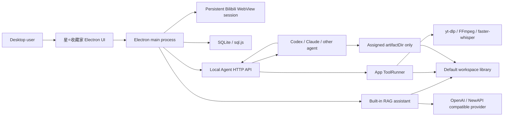

# 星⭐收藏家 Design

## 1. Product Goal

星⭐收藏家 is a local Electron desktop workbench for turning Bilibili favorite-folder videos into structured Markdown through multiple external agents.

The desktop app owns orchestration, persistence, credentials, task leasing, tool execution, validation, and artifact inventory. Codex, Claude Code, and other agents use the local HTTP API to claim one task at a time, ask the app to execute media tools, and submit their final work.

The video pipeline stops at task and tool orchestration and does not automatically create summaries by itself. Separately, the built-in RAG assistant analyzes Markdown that has already passed submission validation.

## 2. Core Boundaries

- The app is the source of truth for users, collections, tasks, leases, tools, runs, submissions, workspaces, and analytics.
- Agents do not edit SQLite, app indexes, collection exports, or workspace configuration.
- Agents only write task artifacts inside the `artifactDir` returned by the claim API.
- Agents never launch project media scripts directly. They call the tool-run API and the app launches the process.
- Disabled tasks are excluded from claims and cannot start new tool runs.
- The desktop task page owns the active collection target. Agents read that target from the API and cannot silently override it while claiming.
- A task lease lasts 15 minutes and can be extended with heartbeat calls.
- Submission paths and Markdown structure are validated before a task becomes complete.
- Accepted documents begin with `小结 -> 思维导图 -> 目录`; the mind map is a valid Mermaid fenced block.

## 3. Architecture



Runtime modules:

- `src/main.js`: window, IPC, startup, encrypted credentials, workspace configuration.
- `src/core/store.js`: SQLite-backed records and migrations.
- `src/core/api-server.js`: Agent API, task lifecycle, validation entry points.
- `src/core/tool-runner.js`: controlled child processes, timeouts, logs, cancellation.
- `src/core/analytics.js`: collection, agent, and tool usage statistics.
- `src/core/workspace.js`: path safety and workspace layout.
- `src/core/bili.js`: Bilibili session APIs and cookie export.
- `src/core/rag-assistant.js`: compatible providers, RAG sessions, retrieval, streaming, model tools, approvals, and usage accounting.
- `src/renderer/*`: frameless desktop UI.

## 4. Persistence

The project uses `sql.js` and writes the database to:

```text
workspace/orchestrator.sqlite
```

The generic `kv` table currently stores these scopes:

- `users`
- `collections`
- `videos`
- `tasks`
- `taskEvents`
- `submissions`
- `tools`
- `toolRuns`
- `workers`
- `activities`
- `workspaces`
- `settings` (including the active collection target)
- `credentials`
- `ragProviders`
- `ragSessions`
- `ragMessages`
- `ragAttachments`
- `ragModelUsage`

Task records are migrated on startup so legacy tasks default to `enabled: true`.

Passwords are encrypted with Electron `safeStorage` where available. The renderer only receives a decrypted password when a saved account is explicitly selected for login.

## 5. Workspace Libraries

The app can register multiple workspace roots. Exactly one must be the default workspace. New claims always use the current default; changing the default does not move or delete existing artifacts.

The built-in default is the project-local directory:

```text
<project>/workspace
```

Agent artifacts use this layout:

```text
<workspace-root>/
  <Bilibili username>/
    <favorite-folder name>/
      [BV-...][title-...][UP-...][published-...][favorited-...][collection-...][tags-...]/
        [BV-...][title-...][UP-...][published-...][favorited-...][collection-...][tags-...].md
        info.json
        frames/
        asr/
        comments/
        tool-runs/
```

Directory and Markdown basenames use one app-owned metadata policy. BV id, title, owner, publish date, favorite-added date, source collection, and tags are enabled by default and independently persisted in SQLite. Publish and favorite dates use visibly distinct labels. Fast collection sync does not fetch per-video tags; submission reads the validated `info.json`, normalizes tags, and then atomically renames the accepted artifact directory and Markdown. Existing accepted artifacts are not silently migrated when settings change. Numeric suffixes resolve collisions.

App-owned collection exports are kept under:

```text
<workspace-root>/.star-note/exports/<username>/<favorite-folder>/
```

Bilibili cookie exports remain app-managed under the project system workspace:

```text
workspace/users/<username>/cookies/
```

Removing a workspace from Settings only removes its registry record. It never deletes files from disk.

## 6. Bilibili Login

- Web content uses the persistent Electron partition `persist:bili-orchestrator`.
- Closing and reopening the app preserves the Bilibili site session.
- Opening the login page does not restart login when the persisted session is already valid.
- Selecting another saved credential is the explicit account-switch operation.
- Account switching clears Bilibili-domain cookies and site storage before attempting the new login.
- One-click login stays disabled until the real Bilibili password form is available.
- SMS verification is detected inside the WebView and bridged to controls outside the WebView.
- Successful login detection automatically refreshes username, avatar, cookies, and favorite folders.
- Manual login detection remains available as a fallback.

The top-right profile popover is disabled while logged out. After login it lists all favorite folders with video counts and latest favorite-addition dates. It has a hover bridge and delayed close so the list can be entered and clicked reliably. Clicking a synced folder opens its task inventory.

## 7. Collection Sync

Collection sync:

1. Resolves the current Bilibili account and requested favorite folder.
2. Reads the full video list through the official Bilibili web API.
3. Upserts collection and video metadata into SQLite.
4. Creates missing tasks and preserves existing task state and enable flags.
5. Exports a compact app-owned synchronization snapshot.
6. Emits transient page/record/progress events while Bilibili pages are being read and indexed.
7. Emits one persisted completion activity after the full synchronization succeeds.

Task metadata includes BV id, title, UP owner, duration, cover, URL, favorite time, publish time, and collection ownership.

The Collections page shows loaded/total counts and a determinate progress bar. Progress events are not written to the activity table, which avoids hundreds of low-value log records during large-folder synchronization.

After a persisted or new login succeeds, the automatic folder discovery result is also written into the Collections page selector. Manual discovery remains available. The sync action stays disabled until that selector contains a real folder. Clicking a folder in the top-right profile popover opens the Collections page and selects the same folder instead of navigating to task inventory.

## 8. Task Lifecycle

Statuses:

```text
pending -> claimed -> done
                   -> rejected -> claimed
                   -> failed   -> claimed
claimed -> pending (lease expiry)
```

The independent `enabled` flag controls dispatch:

- `enabled: true`: eligible for claims when status permits.
- `enabled: false`: visible in inventory, but never returned by claim and unable to launch tools.

Inventory controls support:

- exported-user switching;
- exported-collection switching;
- explicit activation of the collection that agents are allowed to work on;
- BV id, UP owner, and title search;
- favorite-date start/end filters;
- newest-first and oldest-first sorting;
- dual-handle duration filtering;
- selecting all visible tasks;
- inverting visible selection;
- batch enabling and disabling;
- per-task enable toggles.

Claim order is newest favorite-addition time first.

## 9. Agent API

Default base URL:

```text
http://127.0.0.1:17391
```

Endpoints:

```http
GET  /api
GET  /api/manifest?workerId=<workerId>
GET  /api/health
GET  /api/tool-health
POST /api/workers/register
GET  /api/workers
GET  /api/workers/:workerId
GET  /api/collections
GET  /api/active-collection
POST /api/collections/sync
GET  /api/tasks?collectionId=<id>
POST /api/tasks/claim
POST /api/tasks/batch
GET  /api/tasks/:id
POST /api/tasks/:id/heartbeat
POST /api/tasks/:id/submit
POST /api/tasks/:id/fail
GET  /api/tools
PATCH /api/tools/:id
POST /api/tasks/:taskId/tools/:toolId/run
GET  /api/tool-runs
GET  /api/tool-runs/:runId?log=1
POST /api/tool-runs/:runId/cancel
GET  /api/stats?collectionId=<id>
GET  /api/workspaces
GET  /api/templates/video-summary
```

`GET /api` and `GET /api/manifest` are the discovery entry points. They return protocol version, current desktop-selected collection, every Agent-facing endpoint with method/parameters, enabled tool contracts, the template URL, and the standard pause message.

Every fresh Agent session first registers its actual caller tool and model:

```json
{
  "tool": "codex",
  "model": "gpt-5",
  "sessionLabel": "optional human note"
}
```

`POST /api/workers/register` creates and returns an app-owned ID such as `worker-...`. Agents must not invent or reuse a name as identity. The same `workerId` is included in claim, heartbeat, tool-run, cancellation, submission, and failure bodies for the lifetime of that Agent session.

The user first selects and activates a collection in the desktop task page. `GET /api/active-collection` exposes that target. The claim endpoint always uses it; an agent request cannot override the active target with a different collection id or name.

Recommended claim body:

```json
{
  "workerId": "worker-..."
}
```

The claim response includes Worker identity, user, collection, video, lease, cookie, workspace, assigned artifact path, document requirements, API-manifest URL, Markdown-template URL, and every enabled app tool.

Worker allocation state is controlled only by the desktop UI. Pausing a Worker stops future claims and returns HTTP `423`, `WORKER_PAUSED`, and `来自用户的信息，你需要暂停工作`. It does not invalidate an already claimed task, so the Worker may heartbeat or submit that task. Reactivation resumes future allocation. The public Agent API exposes Worker status but cannot pause or reactivate a Worker.

## 10. Tool Modules

Default modules:

- `video-info`
- `material-bundle`
- `merged-video`
- `asr`
- `bili-subtitles`
- `comments-top3`
- `clean-cache`

Tool execution rules:

- The API checks task and tool enable state.
- The app validates `artifactDir` against the task's allowed root.
- ToolRunner first persists every request as `queued`; the HTTP API returns `202` before execution begins.
- ToolRunner spawns a hidden child process without shell string composition.
- Each run has a SQLite record and a log under `artifactDir/tool-runs/`.
- Runs expose stage, resource pool/lane, queue position/length, wait reason, estimated wait, timeout, cancellation, and activity events.
- Queued and stale running records are reconstructed from SQLite after an application restart.
- A queued or running tool run protects its parent task lease from automatic reclamation.
- Temporary downloaded video/audio is removed by `clean-cache` after final artifacts are ready.

Resource pools:

- `api`: two lanes with an 850ms minimum start interval for Bilibili API rate shaping.
- `media`: two lanes shared by yt-dlp, merge, audio extraction, and frame processing.
- `disk`: two lanes for cleanup and other bounded disk work.
- `asr`: one persistent CUDA lane and one optional persistent CPU lane.

Scheduling is fair across Worker IDs: after a lane completes, the scheduler prefers a queued request from a different Worker before another request from the last Worker. Every lane remains single-consumer; concurrency comes from explicit lanes rather than multiple calls entering one process.

At every application startup, the main process launches `node tools/video-tool.js health <action>` for every registered tool. A tool is online only when the script returns the expected `pong` payload and all required local commands are resolvable. A responsive module with missing dependencies is marked degraded; missing scripts, invalid responses, and timeouts are marked offline. The latest results are exposed through `GET /api/tool-health` and the Startup page.

FFmpeg and yt-dlp are project-local npm dependencies and are resolved before PATH. faster-whisper is deployed under `runtime/faster-whisper` on a project-local CPython 3.12 runtime. Multilingual `small` is the fast default and `large-v3-turbo` remains an installed quality option under `runtime/models`; project-local CUDA 12 cuBLAS/cuDNN DLL directories are registered before CTranslate2 loads. `FASTER_WHISPER_BIN` remains an optional explicit override.

`tools/faster-whisper-cli.py` remains the setup, health, and standalone diagnostic contract. `tools/faster-whisper-service.py` is the production NDJSON service contract: it loads one model, accepts sequential transcription requests, and writes SRT, plain text, and structured JSON. `src/core/asr-service.js` owns its lifetime.

The GPU service starts the real project CPython process directly, avoiding the Windows venv launcher between Electron and the long-lived NDJSON pipes, and uses CUDA `float16`. Canonical PCM audio is physically divided into temporary 10-second WAV files so every decoding unit is bounded; chunk files are deleted immediately and progress events are persisted on the tool run. Before dispatch, `nvidia-smi` must report at least 1024MiB free after model load; otherwise the request remains queued with `GPU_CAPACITY_WAIT`. The CPU `int8` service is disabled by default, does not load at startup, and can only be enabled from desktop Settings.

`material-bundle` is a staged plan rather than one monolithic process: Bilibili metadata, per-part station subtitles, and comments use the API pool; download/frame/audio preparation uses the media pool; transcription uses the persistent ASR pool. Direct `asr` similarly prepares `audio/audio.wav` in the media pool before entering the ASR pool. `scripts/setup-faster-whisper.ps1` reproduces both ASR models and the complete runtime through `npm run setup:asr`.

Every summary task must run ASR even when a Bilibili subtitle exists. Station subtitles are validated against each part's duration and minimum timeline coverage before they are declared usable; rejected resources remain as diagnostic JSON with a machine-readable reason. The agent compares usable transcripts and may use selected frames with multimodal reasoning when the better transcript is unclear. Comment analysis uses at most the top three hot comments.

The reference document contract is stored at `templates/video-summary-template.md` and returned by `GET /api/templates/video-summary`. It includes front matter, a conclusion-first summary, an immediately following Mermaid mind map, linked contents, timestamp links, selected frames, subtitle comparison, top-three comment analysis, and processing provenance.

Mermaid 11 is bundled under project-local `node_modules` and loaded by the Electron renderer without a CDN. Preview converts `language-mermaid` blocks to SVG with `securityLevel: strict`. A rendering failure stays local and displays the source plus an actionable error. For legacy accepted documents, preview promotes an existing mind-map section ahead of the table of contents without rewriting the source file.

## 11. Submission Validation

Submission checks:

- `artifactDir` is inside the task's allowed collection root.
- Markdown and metadata files exist inside the artifact directory.
- Required sections exist: summary, contents, mind map, subtitle comparison, comment analysis, and processing log.
- Opening section order is `小结 -> 思维导图 -> 目录`, and the mind-map section contains a Mermaid fenced block.
- Referenced local images exist and remain inside the artifact directory.
- A rejected submission records validation errors and can be corrected and resubmitted.

## 12. Analytics

Collection analytics show enabled, processing, failed/rejected, disabled, completed, and progress counts.

All performance records are separated by app-generated Worker ID. Tool/model/session labels are descriptive dimensions and never merge two Worker sessions.

Per-Worker metrics:

- claimed task count;
- completed task count;
- failed/rejected count;
- success rate;
- weighted processing ratio;
- active tasks and lease expiry;
- tool calls, tool success rate, and average tool duration.

Weighted processing ratio is defined as:

```text
total processing seconds / total video seconds
```

Lower values mean faster processing after normalizing for video duration.

Tool analytics show:

- call count;
- active runs;
- success and failure count;
- success rate;
- average duration;
- unique caller count;
- calls per Worker, including caller tool and model.

The task-page performance popover always opens, including before the first claim. Its empty dashboard explains which independent Worker charts will appear. The Work Agent page is the full management view: it lists each Worker session, current tasks, independent performance charts, caller metadata, last activity, and pause/reactivate controls.

## 13. UI Design

Brand: `星⭐收藏家`.

The app uses a minimal flat rounded icon: a star over three layered collection bookmarks. The reproducible source is `scripts/generate-icon.py`, which writes `assets/star-note.png` and `assets/star-note.ico` without remote assets or font dependencies.

Window behavior:

- frameless custom title bar;
- default size `1350 x 836`;
- startup always restores and centers the default size instead of preserving a previous resize or maximized state;
- minimum size `980 x 680`;
- collapsible left navigation;
- no page-level scrolling at the default size;
- internal scrolling for task, tool, run, log, and workspace inventories;
- themed thin scrollbars, custom selects, checkboxes, ranges, and focus states;
- animated bottom-right operation notifications;
- seven persisted themes.
- each theme has its own startup loader colors; theme changes use a point-origin radial View Transition that fades into the destination palette.
- non-Claude navigation uses Microsoft YaHei UI with fixed icon and text columns; Claude Code keeps its dedicated font family.

Pages:

- Startup: themed backend progress, per-tool interface health, global totals, a collapsed quick-start section, a comprehensive copyable agent collaboration prompt, and all recent processing activities.
- Bilibili login: persistent WebView, encrypted account vault, one-click login, SMS bridge.
- Collections: folder discovery and full collection sync.
- Tasks: explicit Agent target activation, a compact progress band, primary search, collapsible advanced filters, batch state, and agent performance.
- RAG assistant: persistent session list, streaming conversation surface, and a model/knowledge/sandbox inspector; supplier configuration lives in a focused modal.
- Markdown library: accepted-document index by user and collection, BV/owner/title search, favorite/publish date filters, duration range, four time sort modes, and on-demand in-app Markdown preview with local frames.
- Work Agent: independent Worker sessions, current assignments, performance, pause, and reactivation.
- Export: completed Markdown selection across users/collections, a persistent export queue, seven filename metadata controls, and destination-folder export.
- Tool modules: module enable state, usage, prompts, outputs, and open-source attribution.
- Run logs: queued/running history with stage, pool/lane, queue reason, estimated wait, commands, logs, and terminal result.
- Agent API: compact tool usage bars, expandable analytics, and API reference.
- Settings: themes, seven artifact filename fields, multiple workspace libraries, default selection, live GPU/resource-pool state, manual CPU ASR enablement, and runtime state.
- README: a rendered, user-facing summary of this design, Agent onboarding, tools, artifact rules, and RAG export. The page reads the root `README.md` directly so the application and repository share one source.

## 14. Startup Strategy

The renderer shell is displayed before backend work begins. Startup no longer contains artificial delay calls.

Critical startup path:

1. Render desktop shell.
2. Initialize project workspace.
3. Open SQLite.
4. Register Bilibili client and ToolRunner.
5. Probe every tool script and dependency, streaming individual results to the renderer.
6. Query NVIDIA memory, load the persistent GPU faster-whisper service, and restore interrupted queued/running tool calls.
7. Start the local API and expose `/api/tool-health` plus `/api/scheduler`.
8. Mark backend ready. CPU ASR remains stopped unless its persisted desktop setting is enabled.

Snapshots, saved credentials, and persisted-login verification load asynchronously after the shell is usable. The progress panel has only a short visual completion hold.

## 15. RAG Markdown Export

The Export page reads only validation-accepted `done` tasks. Users filter by Bilibili account, favorite folder, BV id, UP owner, or title; select completed Markdown documents; keep selections while switching source collections; and export the queue to a chosen directory.

Filename metadata can independently include BV id, video title, UP owner, source collection, publish date, favorite-added date, and tags. The same token labels are used by workspace artifact naming and export naming. This allows a later RAG importer to classify sources before opening every Markdown body. Each export also writes `star-owner-rag-manifest-<timestamp>.json` with source/output paths and normalized video metadata.

Export safeguards:

- include completed and validation-accepted tasks only;
- preserve source user, collection, BV id, video URL, and timestamps;
- detect filename collisions;
- emit a timestamped machine-readable manifest for every batch;
- never delete source workspace artifacts.

## 16. Built-in RAG Assistant

The assistant is intentionally separate from the external video Worker protocol. It reads accepted knowledge documents, but it cannot mark video tasks complete or bypass submission validation.

Provider contract:

- `openai` and `newapi` currently share the OpenAI-compatible `GET /models` and `POST /chat/completions` wire format;
- the configured Base URL is the API root immediately before `/models` and `/chat/completions`;
- API keys are encrypted with Electron `safeStorage` when the platform exposes it and are never returned to the renderer;
- arbitrary extra request headers support self-hosted gateways without hard-coding vendor rules;
- streaming accepts SSE and providers that return ordinary JSON despite `stream: true`;
- reasoning is displayed only from explicit provider fields such as `reasoning_content`, `reasoning`, or `thinking`.

Model records are user-verifiable capability declarations. The app stores context window and switches for tools, reasoning, vision, audio, image output, compression, and subagents. A switch enables the corresponding request shape or UI; it does not emulate a capability absent from the upstream model.

Knowledge retrieval:

- catalog only `done` tasks whose accepted Markdown path still exists;
- group collections by Bilibili user and allow multiple collections per session;
- split Markdown by headings and bounded character windows, cache by file modification time, and rank passages with title-aware lexical matching;
- inject retrieved passages before inference when tools are disabled, or expose `knowledge_search` when tools are enabled;
- require the model system prompt to cite source title and collection and avoid claims not present in results.

Conversation state persists in SQLite. Each session stores provider/model selection, selected collections, sandbox, permission mode, system prompt, token totals, and optional compressed summary. Messages store visible attachment metadata but not duplicate attachment bodies. Text/PDF/DOCX extraction and media files live in the session sandbox. Per-model accounting consumes provider usage fields when present and falls back to a clearly approximate character estimate.

The tool loop permits at most six model/tool rounds per user turn. Supported tools cover knowledge search, sandbox file list/read/write, Windows CMD, hidden-browser web search/page reading, opening the default browser, and an isolated same-model subagent call. Tool calls, reasoning deltas, content deltas, completion state, and errors stream to the renderer. Cancellation aborts the active provider request and command child process.

Security model:

- restricted mode allows paths inside the session sandbox;
- outside-sandbox paths, CMD, private/local browsing, and default-browser opening require renderer approval;
- an approval can allow once, deny, or promote the session to full access;
- full access broadens filesystem/CMD authority but still restricts browser tools to HTTP(S);
- approval requests expire after two minutes and are denied when the app exits;
- hidden pages run in an isolated sandboxed Electron partition with Node disabled, popups denied, and the browser window never shown.

The current retrieval engine is deterministic lexical RAG rather than an embedding/vector database. This avoids an additional model dependency and works offline, while keeping a future embedding index behind the same collection/session boundary.

## 17. Open-Source Distribution

The repository tracks application source, lockfiles, templates, packaging scripts, and documentation. It intentionally ignores `node_modules/`, `runtime/`, models, `workspace/`, databases, logs, archives, and machine shortcuts. This keeps Git reviewable and prevents credentials or multi-gigabyte binaries from entering history.

Ordinary users receive GitHub Release portable assets assembled by `scripts/build-portable-release.ps1`. Because the complete Windows `small` archive exceeds GitHub's 2GB per-asset limit, the default release is a core archive plus a `small` model archive whose contents preserve the `runtime/models/small` relative path. Extracting both into the same application root provides every runtime tool needed for normal operation; no global Node, Python, FFmpeg, yt-dlp, CUDA Toolkit, package installation, or model download is required. Single-archive builds remain available for distribution channels that accept larger files, and the optional quality model is always suitable for a separate asset.

Project-owned code is `GPL-3.0-or-later`. Third-party software and model data retain their own terms. The FFmpeg executable is a GPL-enabled 6.0 build, while CUDA/cuDNN packages use NVIDIA proprietary redistribution terms. `THIRD_PARTY_NOTICES.md` is the release authority for component versions, source obligations, and license boundaries. Portable archives are aggregates and must preserve all included notices.

All committed paths are relative to the repository root or computed at runtime from module/script location. Release verification rejects common maintainer-specific Windows paths and excludes local Workspace data.
