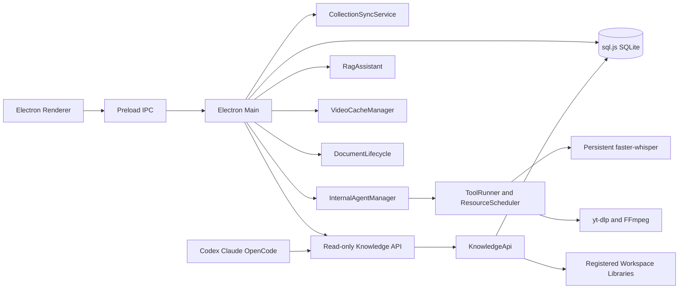

# 星藏家 Design

Version: `1.6.3`

## 1. Product Goal

星藏家 converts Bilibili favorites and application-managed cached videos into durable Markdown knowledge. The product is a desktop workbench, not a landing page: account login, synchronization, task controls, AI execution, media tools, documents, RAG, video playback, export, settings, and status inspection all live in one application.

The system optimizes for:

- long-running local ownership of personal knowledge;
- repeatable video-to-Markdown processing;
- safe multi-Agent concurrency inside the application;
- recoverable collection synchronization and task interruption;
- exact Markdown and image access for local RAG clients;
- project-local dependencies and portable distribution.

## 2. Core Boundaries

1. The desktop application is the only writer of SQLite, task state, Workspace indexes, artifacts, cookies, tool runs, and internal Worker records.
2. Video-summary execution is application-internal. External Agents cannot register video Workers, claim tasks, execute media tools, heartbeat, submit, or abort.
3. The public local HTTP API is read-only knowledge access across all completed Markdown documents.
4. Task Overview switches affect internal Agent claim eligibility. A disabled unfinished task is skipped; an already completed document remains readable. The filtered-only action atomically enables exactly the visible task IDs and disables every other unfinished task in the selected collection.
5. Each internal queue Agent binds its own collection. No global active external collection exists.
6. Single-video mode keeps one canonical output per internal collection/BV pair.
7. Only deletion of a completed task that still belongs to an active Bilibili favorite restores that task to pending.

## 3. Architecture


```mermaid
flowchart LR
  UI[Electron Renderer] --> IPC[Preload IPC]
  IPC --> Main[Electron Main]
  Main --> Store[(sql.js SQLite)]
  Main --> Sync[CollectionSyncService]
  Main --> Internal[InternalAgentManager]
  Main --> RAG[RagAssistant]
  Main --> Cache[VideoCacheManager]
  Main --> Docs[DocumentLifecycle]
  Internal --> Tools[ToolRunner and ResourceScheduler]
  Tools --> ASR[Persistent faster-whisper]
  Tools --> Media[yt-dlp and FFmpeg]
  Main --> API[Read-only Knowledge API]
  API --> Knowledge[KnowledgeApi]
  Knowledge --> Store
  Knowledge --> Workspace[Registered Workspace Libraries]
  External[Codex Claude OpenCode] --> API
```

Important modules:

- `src/main.js`: Electron lifecycle, secure IPC, login session, Renderer snapshots.
- `src/core/store.js`: sql.js persistence and typed record helpers.
- `src/core/collection-sync-service.js`: transactional favorite reconciliation.
- `src/core/internal-agent-manager.js`: internal queue and single-video orchestration.
- `src/core/tool-runner.js`: media tools, resource pools, leases, ASR services.
- `src/core/hardware-capabilities.js`: local ASR environment evaluation.
- `src/core/document-lifecycle.js`: managed deletion and restoration policy.
- `src/core/api-server.js`: minimal read-only local HTTP server.
- `src/core/knowledge-api.js`: knowledge catalog, exact content, search, assets.
- `src/core/rag-assistant.js`: in-app RAG sessions, tools, sandbox, compression.
- `src/core/video-cache-manager.js`: managed download queue and video library.

## 4. Persistence

The database is `workspace/orchestrator.sqlite`. sql.js exports atomically through a temporary file, fsync, backup, and recovery path. Transaction save failure restores the pre-transaction database. On portable-project relocation, the database location is authoritative for the built-in default Workspace: only schema-defined filesystem path fields below the old built-in root are rewritten to the new root. Chat messages, provider prompts and other ordinary text remain unchanged, while separately registered external Workspace paths remain unchanged.

Main record scopes include:

- users, collections, tasks, removedFavoriteTasks, unavailableTasks;
- workers, internalAgentSessions, taskEvents, toolRuns;
- videoCacheCollections, videoCache, videoCacheJobs;
- ragProviders, ragModels, ragSessions, ragMessages;
- workspaces, settings, activities;
- collectionSyncTransactions and submission finalization journals.

Legacy fields such as historical external activation or single-video revision markers may remain in existing databases but have no active product behavior. New code does not create external activation state or multiple single-video revisions.

## 5. Workspace Libraries

At least one Workspace is always registered and one is default. New artifacts use the default library.

```text
<workspace>/
  orchestrator.sqlite
  <user>/
    cookies/
    <collection storageName>/
      <video metadata name>/
        summary.md
        info.json
        cover.*
        frames/
        subtitles/
        asr/
        comments/
        tool-runs/
```

Collection display names may change, so path identity uses collection ID plus a persistent `storageName`. The knowledge API accepts artifacts only inside a registered Workspace real path and rejects traversal and symlink escape.

On Windows, managed paths target a 259-character compatibility ceiling. Artifact naming budgets the final repeated Markdown basename, bounded subtitle names, ASR files and a worst-case tool-run log. Metadata is sanitized for reserved characters, device names and trailing dots/spaces. A long name is reduced with a stable hash but never below 24 characters; if the minimum still cannot fit, `PathSafetyError/WINDOWS_PATH_TOO_LONG` stops the attempt with portable migration instructions. Startup evaluates the default Workspace, its existing collection roots and a conservative future collection shape before dependency prompting. RAG attachments and Markdown export paths use the same guard.

## 6. Bilibili Login

The Bilibili WebView uses a persistent partition derived from the normalized absolute project root, Electron sandboxing, no Node bridge, official-domain navigation only and persistent login state. Password, SMS and QR-code login converge on the same automatic synchronization of user ID, name, avatar and cookies. Every QR-login button press reloads the official login page without cache when it is already open, or navigates to a fresh official login page, before selecting the QR panel. Video navigations are removed from the embedded login surface and opened in a separate sandboxed BrowserWindow using the same persistent partition; unrelated popups and non-Bilibili navigation remain denied.

Saved account passwords require Electron `safeStorage`. Netscape cookie files remain plaintext because yt-dlp requires them and are stored under the user Workspace hierarchy with export time metadata.

## 7. Collection Sync

When the application starts with an authenticated account, `StartupFolderProbe` requests the folder directory exactly once for that account and process. It compares only stable `mediaId` and the last successful remote reported count, returns the folder inventory to the Renderer, and queues a one-time 12-second notice for the Collection Sync page when counts differ. This read-only probe never calls `listVideos`, writes collection/task state, reconciles deletion or rename, stops Agents, or marks a collection as syncing. The user must still start the maintenance transaction below explicitly.

Synchronization is a desktop-owned maintenance transaction. Each explicit sync keeps one persisted batch snapshot for the authenticated Bilibili user, so folder-directory reconciliation and the selected folder's video inventory are committed as one logical operation. The snapshot contains only that user's Bilibili collections and related task/video/tombstone/Agent records; unrelated local operations are not replaced during recovery.

1. Resolve the immutable Bilibili collection ID and current local snapshot.
2. Persist a batch `collectionSyncTransactions` recovery record plus per-collection guards.
3. Mark the collection `syncing` and `syncReady=false`.
4. Stop every internal queue Agent bound to the collection.
5. Abort current attempts, cancel tools, remove attempt files, and invalidate work IDs.
6. Fetch every remote page before changing inventory and retain reported count, visible count, and visibility gap.
7. Reconcile additions, completed archives, explicit unavailable tombstones, rename state, and counts in one SQLite transaction. Missing-item removal is allowed only for a zero-gap snapshot.
8. Remove per-collection and batch recovery records only after the complete operation commits.
9. On interruption or startup recovery, restore the previous batch snapshot and log the rollback. Workflows stopped for synchronization remain stopped and require an explicit user restart.

Reconciliation policy:

- new remote item -> create pending task;
- removed unfinished item -> remove task;
- removed completed item -> keep document and mark `favoriteState=removed`;
- renamed folder -> update display/source name, retain storage identity;
- deleted remote folder -> retain completed documents, mark collection deleted, remove unfinished work, block restart;
- unavailable-video tombstone -> never recreate during later sync.
- reported count exceeds visible pagination -> merge visible additions/updates, preserve every absent local task and artifact as unresolved, expose `remoteReportedCount`, `remoteVisibleCount`, `visibilityGap`, and `preservedUnresolved`;
- a later zero-gap snapshot -> resume ordinary missing-item removal/archive reconciliation.

## 8. Internal Task Lifecycle

Queue workflow states include idle, running, draining, stopping, paused, completed, model-unavailable, unavailable, and error reporting phases.

Task claim requirements:

- selected collection exists and is dispatchable;
- Bilibili collection is sync-ready and not deleted;
- task belongs to the session collection;
- task is enabled;
- task is pending, failed, or an unowned rejected record;
- task is not excluded by the current loop.

Every claim creates a new random `workId`, work directory, claim timestamp, and 15-minute lease. The persistent Worker ID belongs to the Agent session and is reused across videos; model messages are not.

An Agent session stores collection ID plus user/collection display snapshots. Public session state prefers the live collection names and falls back to the snapshots, so event ordering, startup hydration and collection renames cannot produce an empty identity row in the workflow list.

All interruption paths converge on `abortTaskAttempt`:

- cancel queued/running tools;
- stop provider generation;
- remove attempt files or preserve registered cache sources;
- clear work ID, claim, lease, output and error fields;
- return eligible ordinary tasks to pending;
- pause the internal Worker when required.

Confirmed deleted/down/unavailable video errors use `removeUnavailableTask`, not ordinary rollback. Classification requires explicit Bilibili terminal codes (`-404`, `62002`, `62004`, `62012`) or unambiguous video removal wording. Generic file-not-found, media, ASR, network, and Markdown validation errors never create unavailable tombstones. Startup recovery restores legacy validation-error tombstones to pending work.

## 9. Single-Video Lifecycle

Single-video mode creates a normal internal task with `singleTask=true`, but duplicate handling is collection/BV scoped:

- active duplicate -> return existing session;
- completed duplicate without decision -> require explicit user decision;
- abandon -> no state change;
- overwrite -> clean the old artifact, reuse one task identity, reset output state, and process from the beginning;
- failed/pending/missing artifact -> clean and reuse from the beginning;
- no duplicate -> create a fresh task.

There is no accepted revision history. `revision` remains `1` only for compatibility with old records. Overwrite cannot leave sibling single tasks for the same collection/BV.

Deleting a completed single-video document removes all same-BV single-task siblings, linked single sessions, generated files, and task/video records. A later identical BV creates a fresh task and does not show the duplicate modal.

## 10. Document Lifecycle

`deleteCompletedDocument` owns document deletion:

| Source state | Result after deletion |
| --- | --- |
| Active Bilibili favorite | Remove generated artifacts and restore same task to pending |
| Removed Bilibili favorite | Remove artifacts and task; write removed-favorite history |
| Deleted Bilibili collection | Remove artifacts and task; do not restore |
| Single-video internal task | Remove artifact, task, linked session |
| Other local/internal task | Remove artifact and task |
| Cache-backed source | Preserve registered video, cover and cache metadata |

Restoration always uses immutable `collectionId`; collection rename cannot redirect a task.

## 11. Read-Only Knowledge API

The server binds only to `127.0.0.1`. Protocol `3.1` exposes:

```text
GET /api/manifest
GET /api/health
GET /api/knowledge/catalog
GET /api/knowledge/documents
GET /api/knowledge/documents/<documentId>
GET /api/knowledge/documents/<documentId>/content
GET /api/knowledge/documents/<documentId>/assets
GET /api/knowledge/documents/<documentId>/assets/<assetId>
GET /api/knowledge/search
```

Directory filters include user, collection, BV, title, owner, tag, publish date, favorite date, and sort order. Responses expose semantic metadata but no local paths, cookies, keys, work IDs, or mutable task internals.

Content reads are exact UTF-8 Markdown, paged by 1-based lines with a maximum page size and SHA-256. The external API search scans at most 128 MiB per request and reports partial results. A snippet is never presented as full source.

Assets are document-scoped raster images. The server validates artifact root, regular file, real path, size, raster signature and opaque asset ID; supported formats are PNG, JPEG, GIF, WebP and AVIF. ETag supports repeat reads.

Old external video workflow prefixes return HTTP `410` with `EXTERNAL_VIDEO_WORKFLOW_DISABLED`. Non-GET knowledge requests return `405`.

The API rejects unrelated browser Origin values and omits wildcard CORS. It does not authenticate other local processes and must not be exposed to a LAN or public network.

## 12. Tool and ASR Scheduling

Internal tools are registered in SQLite but invoked only through `ToolRunner`. Pools:

- API: Bilibili metadata/subtitles/comments with start-rate limiting;
- media: yt-dlp, FFmpeg, audio extraction and keyframes;
- disk: cleanup;
- ASR: one selected CUDA lane or one selected CPU lane; the lanes are mutually exclusive.

GPU ASR is a persistent faster-whisper service. CPU ASR is disabled by default and starts only after the user enables it.

Hardware detection combines:

- project-local Python and faster-whisper health process;
- selected `small` or `large-v3-turbo` model files; the old `medium` asset remains only in the historical dependency Release for older applications;
- CTranslate2 version and CUDA device count;
- `nvidia-smi` adapter name, total/free/used memory;
- Windows x64 CPU runtime support, system memory, CPU thread count.

Recommended thresholds:

| Model | CUDA compute | GPU total | Startup free | CPU system memory |
| --- | --- | ---: | ---: | ---: |
| small | `float16` | 2048 MiB | 1536 MiB | 6144 MiB |
| large-v3-turbo | `int8_float16` | 3072 MiB | 2048 MiB | 8192 MiB |

`src/core/asr-models.js` is the single registry for model IDs, labels, package IDs, compute types and memory gates. ToolRunner configures both model path and compute type before every persistent service start, so switching models cannot leave the process on stale quantization. A selected CUDA mode disables the CPU lane and a selected CPU mode disables the GPU lane; there is never simultaneous ASR model residency. All requests in the selected lane still share one queue.

Turbo keeps the same multilingual auto-detection, VAD, word timestamps, sentence materialization, SRT, timeline text and diagnostics as the existing models. A real RTX 4070 Laptop comparison over Chinese, English vertical-video and Japanese/music Bilibili audio measured about 1348 MiB Turbo peak allocation above baseline. The 3072 MiB total / 2048 MiB startup-free policy includes headroom beyond that observed peak and remains a capability gate rather than a universal performance guarantee.

Unsupported GPU lanes are disabled. Unsupported CPU environments disable the CPU toggle and block workflow startup when no valid ASR path exists.

Every video passes through the ASR precondition and language-detection workflow. Sources with audio produce sentence-level SRT, readable timeline text, structured segments, language/probability, coverage and silence diagnostics. A video-only source produces a successful empty diagnostic with `noAudioStream=true`; the Agent continues with station subtitles and keyframes instead of retrying an impossible extraction.

Keyframe extraction writes FFmpeg MJPEG output through an image pipe and then persists validated numbered JPEG files. It never exposes the artifact directory to FFmpeg's image-sequence pattern parser, so percent signs or other title metadata in Bilibili, cached-video, and single-video paths cannot corrupt `frame-001.jpg` naming. Material discovery accepts only concrete numbered frame files and ignores legacy pattern placeholders.

Each internal workflow stores a minimum frame count and an interval budget. The effective count is `max(minimumFrames, ceil(duration / frameIntervalSeconds))`, clamped to the supported range and with the final partial interval counted. The default is at least 12 frames and one additional budget slot per 25 seconds. A workflow may opt into `retainProcessCache`; cleanup then preserves the process video and subtitle/ASR cache while still recording disk usage and refusing new work when the protected free-space threshold is crossed.

## 13. Markdown Validation

Accepted output requires:

- Markdown and `info.json` under the assigned artifact directory;
- opening order Summary, Mind Map, Contents;
- Mermaid fenced mind map;
- substantive body and timeline links;
- subtitle comparison and ASR evidence;
- keyframe references that resolve to validated local images;
- comments section and processing record;
- temporary media cleanup unless cache preservation is explicit.

Before validation, deterministic normalization repairs frame filename placeholders against the real extracted frame inventory, rejects literal FFmpeg pattern files, canonicalizes decorated/numbered headings, and orders Summary, Mind Map, and Contents. A remaining validation failure returns the task to pending and cannot be reclassified as a missing video. When a workflow explicitly enables `retainProcessCache`, final validation disables only the temporary-media cleanup assertion because the cleanup tool has already been instructed to preserve the merged video, downloaded subtitles and ASR timestamp files. The normal cleanup path remains strict. Tool-run progress distinguishes queued work, downloader progress and FFmpeg stages; a stage with no stdout is reported as active processing rather than being presented as a fixed 29% completion state.

Model output must contain usable non-whitespace Markdown before deterministic normalization or validation begins. An HTTP-success stream with no final body, including a reasoning-only response, displays an error notice and performs at most five jittered backoff retries. The first usable delta replaces that notice. A provider error payload or terminal safety/filter reason stops immediately without this retry loop. Exhaustion is classified as infrastructure failure: the Agent pauses, the current task returns to pending, temporary attempt files are cleaned, and no empty response is counted as a failed draft. Non-empty malformed Markdown continues through the ordinary two-draft validation flow.

Finalization applies metadata naming with Windows path budgeting, move retries, copy fallback, and a recoverable journal.

## 14. Context Management

Queue Agents create a clean model request for every video. At 82% estimated context usage, or after a provider context-limit response, the same provider/model runs independent semantic map/reduce requests over every source chunk. The resulting evidence pack preserves timeline, facts, steps, parameters, code, constraints, conflicts and uncertainty. It does not alter Worker ID or work ID.

RAG sessions retain conversation history. At 75% of the model window or a lower reserve-safe input boundary, automatic compression summarizes eligible history while preserving the current user turn and avoiding duplicate resend of already summarized messages. Manual compression remains available.

## 15. RAG Assistant

RAG sessions share provider/model configuration with video Agents but have separate conversation state, sandbox, permissions and usage counters. Knowledge tools first expose `knowledge_list_collections`, then accept exact `collection_id`/`collection_ids` scope on document listing and search; collection IDs are never accepted as document IDs, and a requested scope must already be selected in the session. Internal search inspects at most 60000 chunks per request in addition to document, result-character and time budgets, and reports partial coverage rather than implying an empty collection. Same-BVID documents in different collections remain independent sources. Exact Markdown, metadata dates and images remain available through separate tools. Each assistant message records start/end timestamps, duration and tool-call count; tool events carry sequence and response offsets. The Renderer groups every pre-final model segment and its following tool events into one muted disclosure in original order, keeps it open only while that response is streaming, and leaves the final post-tool answer visible. Legacy events without offsets appear first without splitting the stored answer. A failed provider call retains any partial text and completed tool timeline. Restricted mode requires approval for shell commands, sandbox-external paths, default-browser opening and private-network browsing. Hidden-browser traffic uses a loopback-only, short-lived HTTP/HTTPS tunnel proxy that validates every hostname and connects directly to the selected DNS answer; redirects and subresources cannot trigger a second unvalidated resolution. Client disconnects are treated as normal tunnel teardown: both HTTP upstream streams and HTTPS tunnel sockets are closed and their expected reset/abort errors are consumed without a main-process exception. After the initial page load, extraction waits for a bounded quiet interval and adapts the minimum wait for short shell-like pages; it never waits indefinitely. Remote clipboard images use the same connection-time DNS binding principle.

Version `1.6.2` extends the RAG cancellation contract through DNS resolution, approval promises, hidden BrowserWindow navigation, bounded DOM extraction and the temporary proxy. A canceled tool event is persisted as `cancelled`, the outer response is saved as a canceled assistant message, and the controller is released in `finally`, so the same session can send a new turn. `browse_url` is explicitly text/link-only: obvious image URLs are rejected before network work, and image content types return immediately without the dynamic wait. Unsupported image errors disable further web-tool retries for that response; no webpage pixel-viewing tool is added.

The UI displays only reasoning text returned by the provider. Unsupported vision, tools, reasoning, image output, compression or subagent capabilities degrade honestly.

## 16. UI Design

The application uses a custom frameless title bar, eight themes, a compact left sidebar and non-default form controls. The Endfield theme is an original, moderate-density engineering treatment built from warm neutrals, restrained signal yellow and status green; it does not redistribute game artwork, logos or proprietary fonts. Settings navigation has three levels:

```text
设置
  应用设置
  状态查询
    Agent 工作列表
    Agent 工具模块
    Agent 工具状态
```

Renderer snapshots update lightweight global metrics immediately, then schedule only the active page after the navigation frame has painted. Task, document, tool-run, Worker, export and settings DOM trees carry snapshot revisions and are rebuilt only when visible and stale. Internal-Agent streams, RAG streams and video-cache events retain backend state while hidden but do not continuously rebuild hidden surfaces. The outside-toolbox aggregate refresh, provider refresh, shared catalog and video/document selection previews use independent request generations; push events and input changes invalidate older responses before they can repaint or re-enable an action. Video and document previews also use separate debounce timers. This prevents large libraries, concurrent background work and out-of-order IPC responses from blocking or reverting current UI state. The Endfield sidebar uses its black shell with a warm-white selected row, and the optional “B站之外” root entry uses an interruptible height/opacity/position transition while preference restoration remains animation-free.

Favorite Sync keeps the last successful reported, visible, visibility-gap, unavailable, and valid-task counts under the progress bar. Task Overview has no external activation button. Its collection selector defines the inventory currently inspected, and row switches affect internal workflow claims. Mutually exclusive status segments show and filter all, pending, claimed, done, failed/rejected, and disabled tasks; text/date/duration filters compose with the selected status.

Startup is an independently scrollable page. It includes a five-step first-run journey whose buttons navigate in order to model configuration, Bilibili login, favorite synchronization, task inspection and internal Agent workflow creation. The collapsed external knowledge API prompt documents health/manifest discovery, URL-encoded filters, supported sort forms, 1-1000-line exact Markdown pages, validated image reads, source citation and bounded error recovery. Agent Tool Status includes the read-only protocol reference. Resource Scheduling displays ASR hardware compatibility and disables unsupported controls.

## 17. Startup and Dependencies

The main window appears before heavy initialization. Bootstrap progress covers database, dependencies, models, resource pools, ASR health, knowledge API and login synchronization. Tool probes run during startup and report online/degraded/offline state. Startup uses content-height rows and its own vertical scroll container so onboarding, health, prompt and the bounded 500-event log remain reachable at the default and reduced window sizes. Once a Windows portable backend first reaches Ready, it creates a Desktop shortcut that targets the bundled Electron executable with the current portable root as its application argument, working directory and icon source. A per-installation SQLite record prevents repeated creation; failures are non-fatal and reported in the UI.

Project-local runtime and models may be installed from GitHub Release assets. Downloads use bounded retry with backoff and HTTP Range continuation while retaining `.partial` data. Verification prefers the Release asset SHA-256 digest; direct-URL fallback obtains the matching `.sha256` before transferring the large archive. Complete archives survive transient checksum-network failures, and an HTTP 416 response reuses a partial only after its size and SHA-256 are verified; otherwise the transfer restarts from byte zero. Unverified content is never installed. Installation uses staging, backup, an operation journal and startup recovery reporting, then refreshes ASR and tool health without requiring an application restart. Automatic updates execute the helper from the verified staged package so the new replacement manifest is effective even when upgrading from an older app. Recognized update downloads, staging trees and completed-operation backups are count/age bounded; active journals, a prepared package and failed-recovery evidence are never removed by routine cleanup. Migration checks the old project process list both before scheduling and again in the helper after the new application exits. Archives may write only below `runtime/`.

The Bilibili WebView partition is derived from the normalized absolute project root, so separate project copies do not share login cookies. A one-time migration from the legacy fixed partition is allowed only when the current project already contains a stored Bilibili user record; blank deployments do not import another copy's login state. Cookie identity is domain/name/path. A partially failed migration remains `retry-needed`; the next startup copies only identities missing from the target and never overwrites an existing target cookie. Old markers with a positive error count are retried, while successful old markers remain idempotent. The legacy partition is retained for rollback compatibility.

The two current models support local ZIP import. The accepted asset name is generated only from `dependencyReleaseVersion`; the selected file must exactly match that name and the official Release SHA-256. Archive inspection rejects links, traversal, foreign runtime paths, the wrong model directory and missing probes before maintenance mode or target replacement. Import cancels and joins an in-flight automatic download for the same model, removes its `.partial`, archive, staging, backup and transaction residue, then copies the selected file into a managed temporary location. Each successful installation writes a managed manifest containing schema, package ID, dependency release, logical asset name, verified archive SHA-256 and exact probes. That manifest is included in the same staging/backup journal as the payload, so rollback restores both. Existing official v1.0.0 probe-only installations receive one explicit checksum-backed adoption; an adoption marker prevents future missing or malformed manifests from being silently trusted. Existing healthy model files remain untouched until verified staging commits atomically, and remain available after validation failure. Package-name links and error dialogs point to the exact dependency Release. The v1.0.0 medium asset remains untouched for older applications.

Version `1.6.1` keeps runtime and ASR dependencies pinned to baseline `1.0.0`. The current dependency manager exposes `large-v3-turbo` as the required default and `small` as an optional alternate. The historical `medium` package remains untouched in the v1.0.0 Release for older applications and is not exposed by the current model registry. The published Turbo asset contract is `Star-Owner-v1.0.0-model-large-v3-turbo.zip`; packaging can build it with `npm run package:model:turbo`. The core archive contains the complete application runtime except model weights. Runtime child processes use the project-local Electron/Node, Python, faster-whisper, FFmpeg, yt-dlp, Portable Git and packaged JS modules; NVIDIA `nvidia-smi` and Windows utilities are resolved from known absolute system locations and receive a controlled environment, never a user PATH fallback. The updater accepts only a stable `latest` Release, validates the staged manifest, lockfile, transaction helpers, Electron, Python, FFmpeg, VC++ and Portable Git before scheduling replacement, and revalidates the staged package before launch. The shared-document uploader and downloader additionally require the project-local Portable Git under `runtime/git`; they never fall back to a system Git installation or global Git configuration. Shared repositories require the stable `validate-shared-docs` status check before merge; when an owner configures an existing repository, the app updates only the status-check protection subresource and preserves existing review, CODEOWNERS, restriction and admin rules. Each contributor reuses one valid Fork per upstream repository but creates a fresh contribution branch from the latest upstream target branch for every upload. The catalog Action validates the exact generated commit on a temporary branch, reports that same SHA under `validate-shared-docs`, checks that `main` still has the expected parent, and only then promotes it without force-pushing; the workflow explicitly passes its Actions token to the publisher. Multi-part completion and upload eligibility are derived from non-empty standard `index.md`/`summary.md` files, with safe fallback from stale database pointers. The complete shared-tool contract is maintained in `DESIGN_SHARED_KNOWLEDGE.md`.

Media tool subprocesses never resolve `node` through the system `PATH`. Normal source tests use `process.execPath`; the desktop application launches its bundled Electron executable with `ELECTRON_RUN_AS_NODE=1`. Python processes receive `PYTHONUTF8=1` and `PYTHONIOENCODING=utf-8`, and streamed stdout/stderr use incremental UTF-8 decoders so a multibyte Chinese character split across chunks is not replaced.

### 1.5.1 Renderer layout and startup wordmark

The overview keeps onboarding and tool-health panels at their natural size while the recent-activity panel consumes only genuine remaining viewport height; disclosure expansion restores a bounded default activity height and normal page scrolling. The window title selects one of six fixed wordmark definitions once per Renderer startup. Chinese glyphs use medium-weight Microsoft YaHei-compatible faces and title-bar-aware black/white contrast, while English display faces use per-theme accent colors; the decorative swash is an inline SVG shown by one variant only.

The GitHub sharing surface uses aligned headings, fixed-width two-row command groups, distinct list surfaces, persistent filter chevrons and a generation-gated local snapshot refresh. Its mount-target picker can select an existing shared collection, create a named collection inline, or let the mount request supply a date-based fallback name. Local-tool detail pages keep centered headings, top-left navigation and bounded content width. These are Renderer-only changes over existing preload and main-process APIs; no IPC, database, repository identity, mount source or upload transaction contract changes.

### 1.5.0 Shared-tool, README and RAG presentation

The GitHub sharing tool keeps repository configuration collapsed until requested, aligns its download/mount and upload/commit columns through shared tracks, and uses a bounded centered width for local import tools. README Markdown may retain GitHub-compatible inline HTML only after Renderer sanitization; relative raster images are resolved through a main-process path, size and signature boundary. The RAG knowledge picker groups catalog entries by stable user identity and collection kind while preserving collection IDs for selection and retrieval. Search hides empty collection-kind and user groups, and document counts remain a no-wrap secondary line. These presentation changes do not alter task execution, repository transactions, RAG retrieval or persistence contracts.

### 1.4.18 ASR timeline normalization and retry

Every faster-whisper output is normalized before SRT, timestamped text and JSON are written. Adjacent duplicate or contained segments are merged, recoverable start-time regressions are repaired in transcript order, and empty individual segments are dropped. An entirely empty `segments` array remains valid and carries a no-speech diagnostic; it is not treated as an ASR failure. The independent artifact validator remains strict for non-finite, reversed or non-monotonic timestamps and reports the exact segment. ToolRunner validates the three artifacts before any Agent model request. A failed output validation can run up to three ASR attempts in the same scheduled ASR lane: the default profile, a no-previous-text profile, and a conservative low-beam/VAD profile. Infrastructure errors are not silently reclassified as output validation errors.

### 1.4.17 Shared-tool hierarchy

The download pane orders remote commands, the target shared collection and remote filters before the remote catalog. Local mount selection controls sit between the remote and local trees. Both download/mount and upload/preparation flows use compact downward indicators, while responsive layouts keep command groups wrapped without overlapping labels or list content.

### 1.4.16 Stability and interaction notes

High-frequency multi-P session state, tool progress and child-process logs are updated in memory and flushed in bounded batches; stage transitions, cancellation, terminal results and shutdown recovery remain durable immediately. A failed child P is represented as a disabled pending task with an explicit retry reason, and the parent viewer exposes individual and batch continue/retry controls. The parent index prefers the P1 cover/first keyframe and falls back safely when that asset is unavailable. Shared-tool mount actions sit beside remote catalog loading, while the remote tree, local mount tree and upload candidates use the same nested visual hierarchy.

## 18. Supported Video Boundary

The ordinary single-video and batch Agent workflows accept ordinary Bilibili BV videos with exactly one page. Metadata inspection is mandatory before media download: more than one `pages` entry produces `UNSUPPORTED_VIDEO_TYPE`, cleans the current attempt, disables the task and records a skipped rather than failed Agent outcome. Inputs under Bilibili bangumi (`ep/ss/md`), cheese, festival, audio and live routes are rejected before URL-to-BV resolution. Favorite entries without a BV are retained as disabled inventory records with a visible reason. The independent “B站多P视频总结” tool now handles one standard multi-part BV parent at a time: it persists CID-based P children, limits internal concurrency, writes a deterministic parent index, supports stop/continue, refresh/append and parent deletion, and keeps completed P outputs after interruption. The parent viewer can flatten each parent into per-P rows with live progress, phase and CID, collapse back to the aggregated parent progress, and stop one active or pending P without affecting siblings; a failed replacement worker is reported as a warning while the stopped P remains safely rolled back. Provider rate-limit, concurrency and temporary capacity errors use bounded backoff retries, while explicit credential/parameter errors stop immediately. During streaming, high-frequency P events only schedule a throttled viewer update; they do not scan the full task/session store, persist a task for every token or send multipart model text to unrelated Agent pages. The parent index copies only each completed child's normalized `## 小结` section, rebases its relative resources, and links the complete child Markdown; startup deterministically upgrades existing local indexes without another model request. Multi-part and special pages remain rejected by the single-video and batch Agent entry points.

## 19. GitHub Shared Bilibili Knowledge

Only completed Bilibili summary artifacts can be shared. A single-video artifact uses a stable contributor/source-collection/BVID identity; a multi-part artifact is shared as one complete parent package containing the index, P child summaries, metadata and permitted raster resources. The remote path is rooted at the contributor GitHub numeric ID and a stable source namespace, so Bilibili account and collection display-name changes do not misroute updates.

The uploader validates the local task and artifact, opens GitHub in the default browser for authorization, and stores the resulting credential in an application-private DPAPI store selected explicitly for the bundled Git Credential Manager. A pasted Fine-grained Token remains an explicit fallback. A repository is persisted only after GitHub confirms it exists and its `_star-owner-repository.json` matches the actual owner/name, default branch, schema and required capabilities. For a repository owned by the authorized account, the app configures the stable `validate-shared-docs` Action context as a required pre-merge status check; an owner connection or one-click repository creation therefore needs branch-administration write permission (Fine-grained Token: `Administration: Read and write`; classic Token: the corresponding repo administration scope). Existing protection is changed through the status-check subresource/context append endpoint so review, CODEOWNERS, restriction and administrator rules remain intact. Verified repositories are retained in an application registry; opening the shared tool health-checks the active entry without replacing it on failure. Authorized users can create a public personal repository with the repository contract, contribution files, PR template, CODEOWNERS, validation Action and catalog Action preinstalled. Repository ownership is decided by immutable GitHub numeric ID: the owner pushes a temporary upstream branch and opens a PR, while other contributors create or reuse a valid Fork. Git commits use the authenticated account's GitHub noreply identity so contribution attribution remains correct. Clearing authorization removes only the encrypted application record and project-local DPAPI store; it never invokes system credential erase/logout or changes global Git.

One upload accepts at most 1000 complete documents and 1 GiB total. Artifact files are copied from validated source paths instead of being buffered together in memory. Single-video packages rename the selected final output to canonical `summary.md`; multi-part packages contain canonical `index.md`, `parts/cid-*/summary.md`, referenced raster assets and generated sharing metadata. Agent drafts, ASR/subtitle/comment caches and local process JSON are excluded. Metadata declares `entryMarkdown`, entry/Markdown/resource SHA-256 values and exact files, so the repository Action, downloader and RAG resolve the same final document instead of an alphabetically earlier draft. A full-window modal owns input focus for the operation, reports preparation/Git/PR progress, and exposes an explicit cancel action; cancellation aborts GitHub requests and bundled Git children and then cleans recognizable temporary branches and checkout directories. The downloader first reads the root `catalog.json` generated from merged main-branch metadata, validates its schema, paths and per-document size fields, and falls back to a Git tree scan only for missing, stale-format or invalid indexes. Changed documents in one mount are imported through one bundled-Git partial clone and sparse checkout limited to the selected document roots; if that checkout cannot be created, the API compatibility path still reuses one tree for the batch. Repository/selection limits and free space on both the project cache disk and destination Workspace are checked before import. Mount changes use collection-scoped database snapshots and delayed old-directory cleanup, so any failed document restores the complete batch, including previous files, task records, exclusions and `remotePaths`. Repository validation Actions bind write access to `pull_request.user.id`; catalog Actions serialize runs and rebuild/retry after a competing main-branch push. Existing local hashes and remote versions are compared before download, unchanged mounts return immediately, and an overlapping document mount is absorbed when its whole remote collection is mounted. Every surviving mount persists its repository identity, so changing the active repository cannot redirect it. Shared collections remain visible to the document library and RAG, while Renderer selectors, Store task activation and Agent creation/claim checks all exclude or reject them.

Shared and multi-part tasks enter the existing knowledge API and RAG as read-only completed documents. RAG sees the multi-part parent/index metadata and can retrieve P children by `parentDocumentId` plus `partId`/`cid`; it must not collapse same-BVID documents from different contributors or source collections.

## 20. Outside Tools UI

The “B站之外” page is organized as independent tool entry cards with compact live status data. Its state is hydrated only after the backend reports ready, preventing startup-time service-unavailable notifications. Activating a card moves its existing functional body into a focused full-content view with a top-left return action; returning restores the body without rebinding or losing state. The multi-part view uses a left creation/execution pane and a right parent-task viewer, while the shared-knowledge view uses a left remote catalog/mount pane and a right local-summary upload pane. The upload pane supports searchable user and collection datalists, title/BVID/owner filtering, completion-time ordering, a duration range, select-all for the current result, and a fixed-height preparation list grouped by collapsed source collection. The preparation list has its own title/BVID/owner and collection filters, select-all-visible and remove-visible operations, and keeps its expanded browsing area in empty state. The remote catalog tree has a vertically resizable viewport and separate searchable identity/title filters. Repository validation/creation, catalog reads, mounts and single/batch synchronization expose one consistent progress surface backed by both event delivery and renderer polling. Responsive rules stack split panes at 1120 px and below, while the supplementary multi-part requirements field follows the active theme's text and background colors.

## 21. Security and Reliability

- Electron main and WebView run with sandbox boundaries and strict navigation policies.
- Credentials require safeStorage; cookies remain local plaintext only where tools require it.
- Provider Base URLs, headers, private networks and hidden browsing are validated.
- Knowledge-library and RAG Markdown keep raw HTML disabled. The bundled project README alone accepts GitHub-style HTML through a DOMPurify tag/attribute allowlist; its images are limited to HTTPS or raster files whose real paths remain inside the project. Knowledge images remain constrained by source, size and signature.
- Filesystem deletion and API reading resolve real paths under registered roots.
- Update archive validation rejects Win32 drive, UNC/device, NTFS alternate-stream, control-character, dot/empty segment, reserved-device and case-collision paths before extraction.
- Application shutdown and restart recovery abort active video attempts rather than resuming partial state.
- SQLite and dependency installation use recoverable writes.

## 22. Verification

`npm run verify:release` checks package/lock versions, machine-specific paths, JavaScript/Python syntax, all integration tests including local media/document tools, multi-part/shared knowledge, Git/Node/Python runtime isolation, both ASR models and npm audit. `test:runtime-node` deliberately removes the global `PATH` and verifies that the bundled Electron Node mode still executes the video tool; `test:runtime-isolation` checks controlled PATH/environment handling and project-owned child-process boundaries; `test:git-runtime` verifies that global Git config and external Git paths are rejected. Shared-knowledge tests additionally cover private authorized reads, owner/Fork routing, repository-contract validation and registry persistence, repository-specific mounts, repository-isolated batch synchronization, visible operation progress, actual default-branch templates, upload limits/cancellation, repository file allowlists and cross-repository multi-part isolation.

Protocol and lifecycle gates include:

- `scripts/knowledge-api-test.js`;
- `scripts/hardware-capabilities-test.js`;
- `scripts/internal-agent-test.js`;
- `scripts/document-lifecycle-test.js`;
- `scripts/collection-sync-test.js`;
- `scripts/security-test.js`;
- `scripts/smoke-test.js`.
